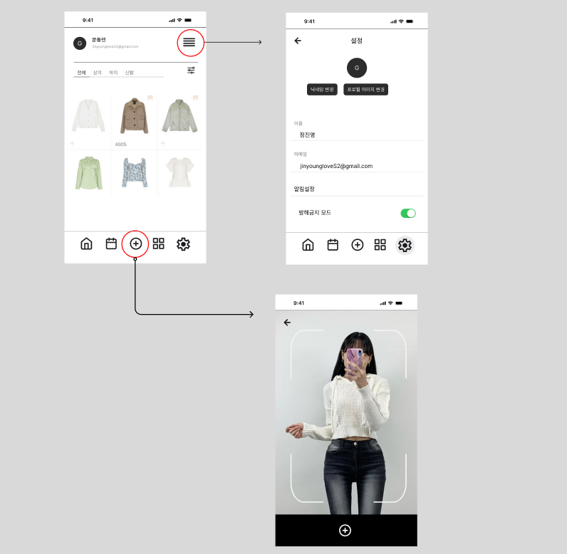
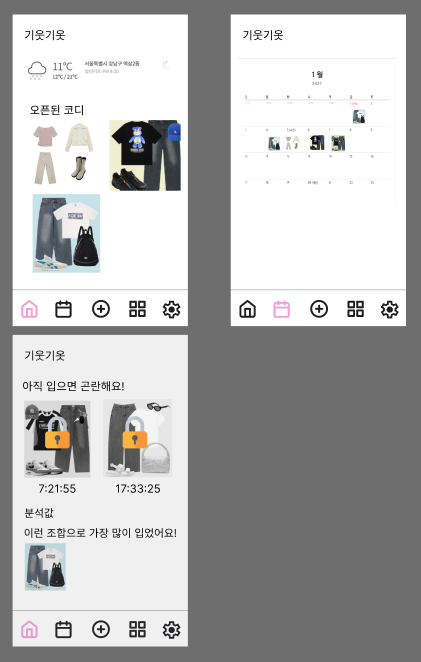

1. 사용자의 입력 줄이기

1) 시간대 설정

- GPS를 활용해서 회사의 위치를 판단

2. 옷 사진

- 사진은 찍자..ㅜ
- 옷을 찍고 중복되지 않게 옷장으로 넣어주기

2. 데이터 수집 고려사항

1) 옷의 색상
   기본 색상(검정,흰색)

튀는 색상

2. 옷의 패턴
3. 옷의 조합
4. 옷의 브랜드

목표
기능 생각해보고 관련 기능 구현 알아보기

check list
[x] 프로젝트 목표가 무엇일까?

[x] 사용자에게 어떤 편의성을 제공할 것인가?

내용
기능 분석
저장 데이터를 활용한 사용자 맞춤형 착장 분석 서비스 (개인)

촬영한 사진 데이터 분석

어떻게 분석할 것인가?

전체 사진 갤러리형

상의, 하의 분리 후 데이터 처리 (2d로 처리 등)

분석 후 텍스트 데이터

어떤 데이터를 분석할 것인가?

<실시간 데이터> ⇒ 데이터 분류

촬영일 (요일)

계절

날씨

<옷 분석 데이터> ⇒ 가중치 분석

브랜드 (가격) ?

패턴

악세사리 (모자 등…)

주간 분석

월간 분석

날씨 분석 (기온…)

b~d 분석 → 사용자 맞춤 착장 추천 서비스로 활용할 수 있음

음성 및 GPS 데이터 분석

음성 데이터 분석

누구와, 얼마나 많이 이야기 하였는가?

GPS 데이터 분석

어디서 이 옷을 입고 어떤 일정을 소화하였는가?

특별 일정 분석 데이터

평소랑 다른 무엇을 하였는가?

앉고 일어서기 데이터

앉아있을 때 보다 일어서고 움직일 때 실행할 수 있지 않을까?

GPS 데이터를 활용한 실시간 유저 서비스 (커뮤니티)

실시간 다른 유저 착장 분석 서비스

Etc.
언제 알림 서비스가 가야하는가?

어떻게 데이터를 처리할 것인가?

회의록
백그라운드와 포그라운드 : 리액트 네이티브

언제 실행해야하는가?

일주일 기간동안 데이터를 수집해서 사용자 맞춤 시간 설정이 가능하다.

앉고 일어서기 데이터를 활용할 수 있지 않을까?

결과를 알려줄 때 : 자기 전, 퇴근했을 때 (GPS)

‘내일은 어떤 옷을 입으실건가요?’

이 착장은 ~~도시에서 많이 입고 있습니다!

2주차 일정

1. ~07.17 : 데이터 수집
2. ~07.15 : 기능 구체화
3. 07.16~07.17 : 레퍼 참고하여 디자인
4. 07.17~07.18 : 기능별 화면(피그마)
5. 07.18~07.19 : 기능 테스트

<피그마 작업>

