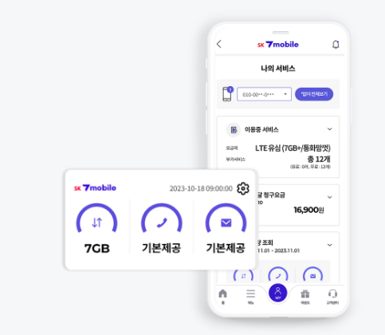

240716 오전 회의

<목표 리스트>

데이터 수집

근거를 위한 자료 수집 (인지학, 음성 데이터 활용 등)

레퍼런스 찾기

메인 기능이 무엇일까 정의하기 : 요금제 어플과 같이 명확하게 

무엇을 가장 먼저 보여줘야 할까?

최근 3일치의 옷을 보여준다.

가계부처럼 옷에 대한 분석 (색상, 바지 재질)

음성 데이터에서 가져올 수 있는게 무엇이 있을까?

대화의 길이

음성의 세기

억양과 톤 → 긍정 부정 판별 

대화의 내용 분석 → 필터링이 필요할 것 이다.