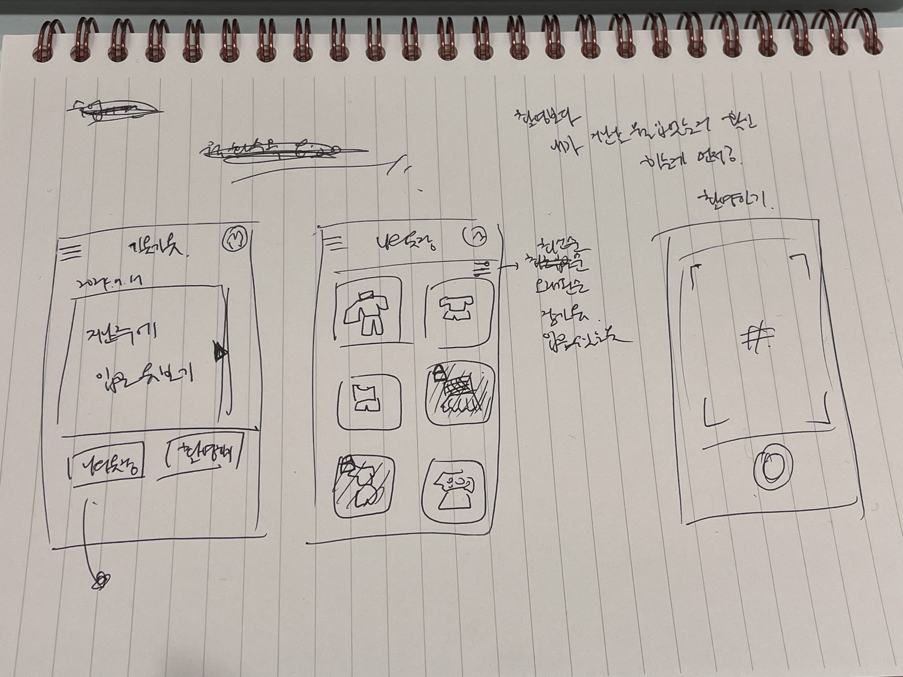
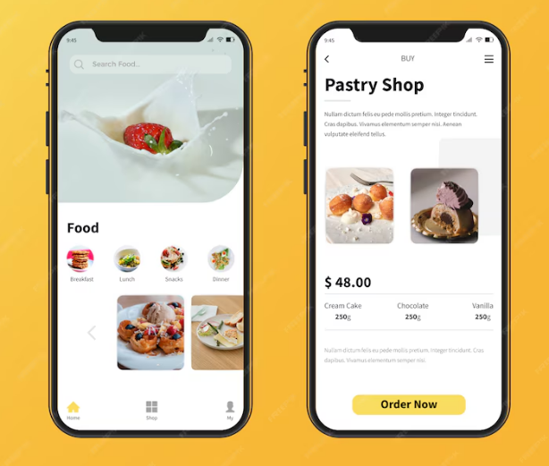
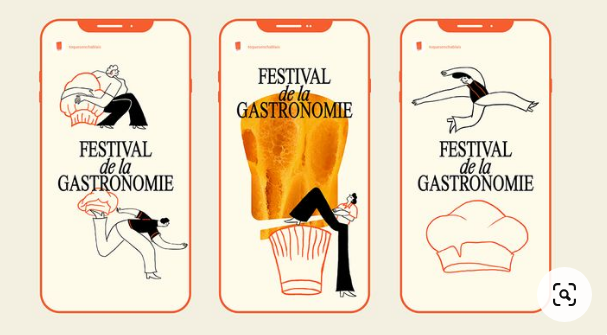
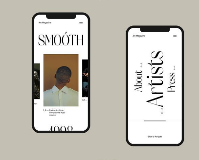
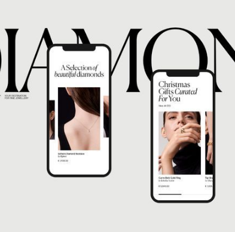
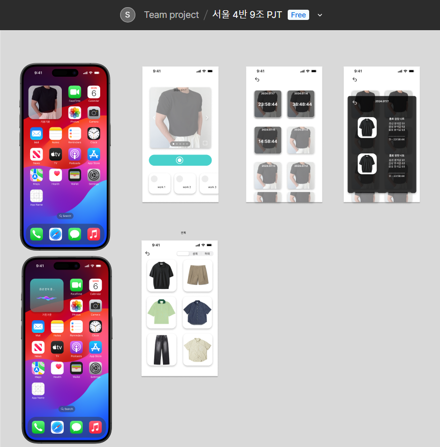

## 와이어프레임을 위한 앱 레퍼런스 조사

  
1. 

내가 이 어플을 사용한다면 ?

촬영보다는 지난 주 입은 옷을 보고 싶을 듯. 오늘은 그 옷을 안 입도록!

 

2. 

깔끔함. 사진 집중. 

but, 사람들이 사진 찍는 곳이 동일할텐데 (ex. 본인 집 전신 거울) 사진이 단조로워도 예쁠까??

 

3. 

귀여움. 우리 팀만의 그림체로 가져갈 수 있을 듯

 but, 내부 레이아웃은 아직 상상 안됨

 

4. 

개성 레전드

타겟층 좁혀짐. 남자들도 사용할까? 누군가에겐 거부감이 들 수도 

 

5. 

잡지 느낌

4번보다 중성적, 깔끔함, 필요 기능들만 눈에 확 보여줄 수 있을 듯 

### 와이어프레임 
