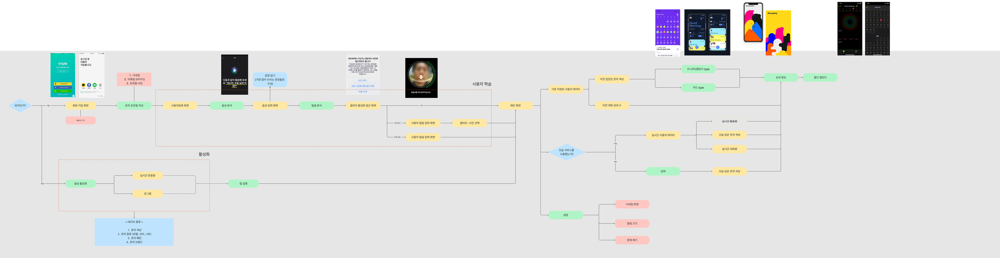

유저 플로우 작성 (24.07.19)

1. 회원 가입 

  - SNS 로그인

2. 사용자 인식

  - 음성 인식

  - 얼굴 인식 → 갤러리 등을 활용하여 유저 데이터 베이스 구축을 위함

3. 메인 화면

  - 주간 캘린더 형식의 사용자 기록 

  - 카드 형식의 사용자 기록 

  - 월간 캘린더

    - 원형 이미지를 활용한 월간 옷 표현

  - 설정

    - 닉네임 변경

    - 소리 끄기 → 추후 논의

4. 음성 활성화

  - 실시간 채팅형

  - 로그형