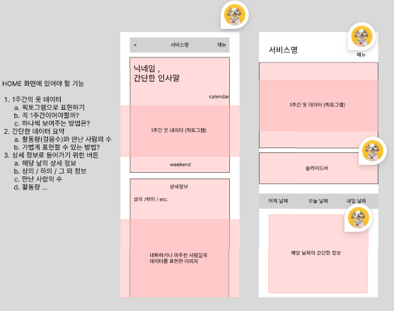
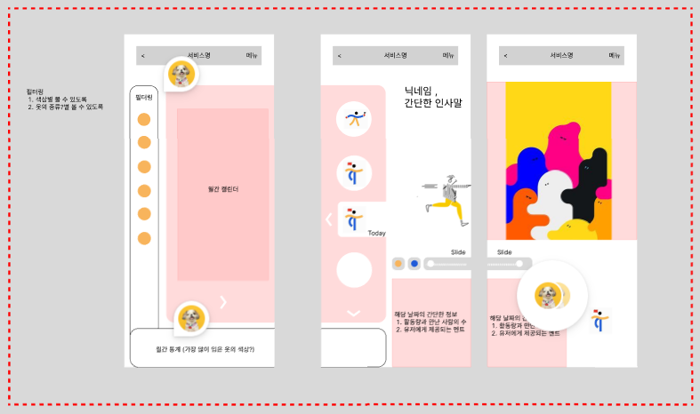
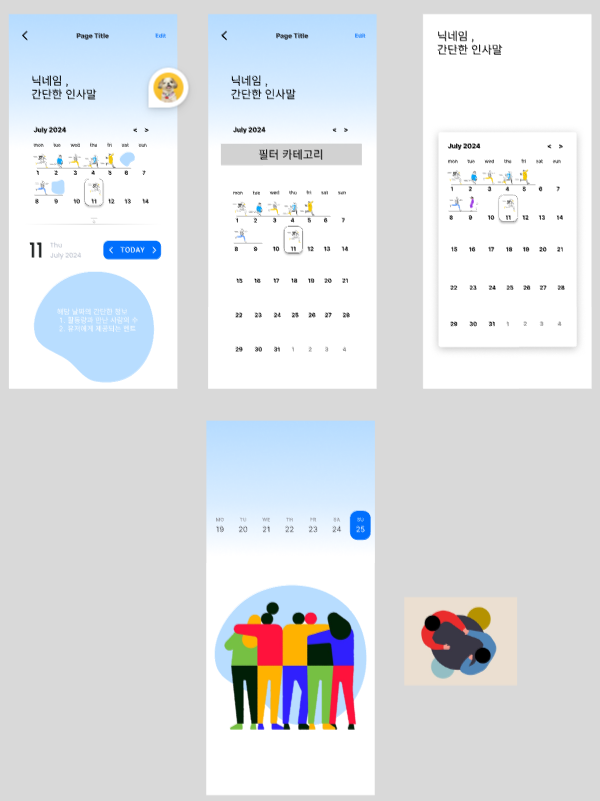
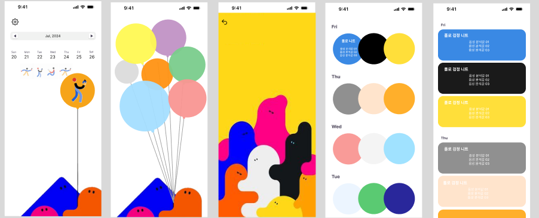
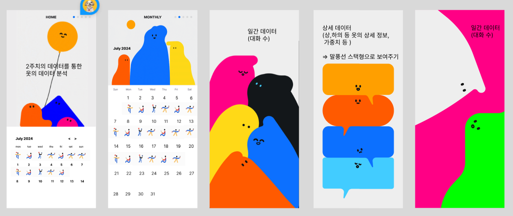

# 오전 팀 회의
주말 와이어프레임 피드백
 

- 먼저 2주 형식 보여주고, 클릭하면 월간 캘린더로

  -  아래 하늘색 물방울 → 2주 동안 가장 많이 입은 색, 패턴 / 카드형 

  - 캘린더는 옷 색상 보여주기 

  - 누르면 상세 정보 (옷 질감 등은 사용자가 원하면 입력하기)

- 오늘 입어도 되는 색상을 먼저 보여주기 

  - 들어갔을 때 내가 뭘 입어도 되는 지를 알고 싶지 않을까 ?

  - 캘린더 내 자물쇠 기능

  - 음성으로만 정보 전달 / 앱에서는 입은 옷만 보여주기 vs 앱에서도 정보를 전달해야 하나 ?

 - 홈 화면 

  - 정보 전달 (텍스트 최대한 지양)

  - 음성 활성화 관련 제스처

 

- 언제 사용자들이 앱을 들어갈까?

  - 처음 옷 입는 시간 외에는 음성 기능이 홈 화면에 필요하지 않을 듯

    - 음성이 오전에 활성화되면 뜨지 않게 ?

# 오후 와이어프레임 수정
