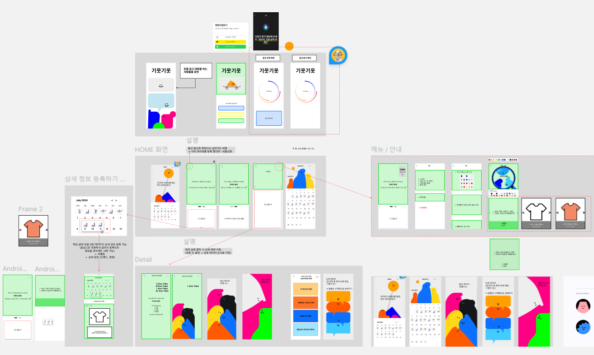

# 와이어프레임

# 와이어프레임 피드백
 

- 메인 화면 들어가기 전, 튜토리얼

- 현재 서비스가 뭔지 잘 모르겠음

  - 입력받는게 난해함

  - 캐릭터를 직접적으로 달력에 쓰니까 눈에 잘 안들어옴

  - 사용자가 다 눌러서 들어가는 건 귀찮음 ( 절차 너무 많다 )

  - 라벨링 빼도 될 듯

  - 대화량 분석도 자연스럽지 않음

  - “이 옷 당분간 입지마!” 라는 내용이 강하게 드러나야 한다 !!!!!!

  - 기술적인 허들도 많을 서비스 

  - 서비스 설득력 X , 방향성 잘못됨

  - 이미지와 텍스트의 나열 X , 어떻게 보여줄 것인가 ?, 서비스 더 생각해보기

  - 단순해도 되니까 원래 서비스의 목적 잊지 않기 

 

- 기능 명세서와 요구 사항 정의의 차이

  - 기능 명세 다시 적고, 일정이랑 우선순위 정해서 내일 다시 미팅

 

- 일정 정리

  - 이번 주 안에 자세, 음성, 블루투스 끝내기

  - 26일 발표