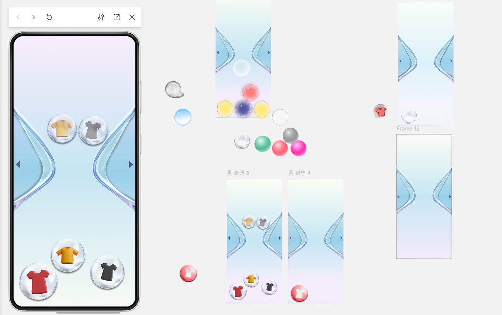

## 와이어프레임 피드백
 

- 유저 플로우의 화면 흐름이 안보임

- 등록은 왜 해?

  - 등록 자체를 빼는게 좋아보임

  - 사용자를 왜 괴롭히려고 하는 건지 이해가 불가능

  - 사용자가 내 옷을 등록하는 순간 망한다고 생각함

- 둘 중 하나

  - 컨텐츠 - 사용자가 정말 쓰고 싶게 해야 함

  - 편함 - 사용자가 쓰기 편함

- 음성 등록도 애매함

- 옷의 정보가 없는 서비스는?

- 모래시계 알고 보면 보이지만, 유저에게 바로 의미가 보일까?

- 재미있게 보여주기. 현재 직관적이지는 않음

- 디자인 완성 X - 굳이 보라색 톤?

- 라이트하게 “ 입지마라!“만을 표현했으면

- 기술적인 시도, 트렌디함 추구 

- 왜 등록해야해 ????????

- 인형 뽑기 메인 화면

  - “입어도 되는 옷들 중에서 오늘 입을 옷 하나 골라줘” 정도의 느낌임

   - 서브 기능으로는 괜찮지만 메인으로는 X

  - 우리가 왜 이걸 해야 하는지 ?

- 모래시계

- 흔들림이 필수

- 내가 가지고 있는 옷을 보여준다면 최고

- 내가 가지고 있는 옷에 대한 메타 데이터를 추가로 보여준다면 더 좋을 것 같음

- 등록 화면

- 팔레트 나오는 방식

- 팔레트가 펼쳐지면서 사용자가 선택하는 액션 ?

- 지금은 너무 일하는 느낌. 사용자가 안 쓸 듯

- 간단한 터치 정도의 수준으로 수정

- 어떻게 그날 입은 옷을 캐치할 수 있을까? 등록말고ㅠ

- 편한 등록 방법을 찾아보자,,,,,

모래 시계 위가 잊혀지지 않은 옷이라는 걸 더 확실하게 어떻게 보여줄지 ?

배경색 ?

등록 방법 ?

음성 등록과 팔레트에서 색 선택 ?

홈화면 / 등록화면

## 메인화면 수정
