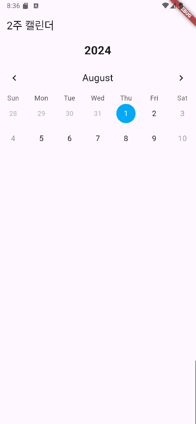

## 플러터 강의 실습
```dart
import 'package:flutter/material.dart';

void main() {
  runApp(App());
}

class App extends StatelessWidget {
  @override
  Widget build(BuildContext context) {
    return MaterialApp(
      home: Scaffold(
        backgroundColor: Color(0xFF181818),
        body: Padding(
          padding: EdgeInsets.all(20),
          child: Column(
            crossAxisAlignment: CrossAxisAlignment.start,
            children: [
              SizedBox(
                height: 80,
              ),
              Row(
                mainAxisAlignment: MainAxisAlignment.end,
                children: [
                  Column(
                    crossAxisAlignment: CrossAxisAlignment.end,
                    children: [
                      Text(
                        'hey, Selena',
                        style: TextStyle(
                          color: Colors.white,
                          fontSize: 28,
                          fontWeight: FontWeight.w800,
                        ),
                      ),
                      Text(
                        'welcome back!',
                        style: TextStyle(
                          color: Colors.white.withOpacity(0.8),
                          fontSize: 18,
                        ),
                      ),
                    ],
                  ),
                ],
              ),
              SizedBox(height: 120,),
              Text('Total Balance',
              style:TextStyle(
                fontSize: 22,
                color: Colors.white.withOpacity(0.8),
              )),
              SizedBox(height: 5,),
              Text('\$5 194 482',
                  style:TextStyle(
                    fontSize: 42,
                    fontWeight: FontWeight.w600,
                    color: Colors.white.withOpacity(0.8),
                  )),
              SizedBox(height: 20,),
              Row(
                children: [
                  Container(
                    decoration: BoxDecoration(
                      color: Colors.amber,
                      borderRadius: BorderRadius.circular(45),
                    ),
                    child: Padding(
                      padding: EdgeInsets.symmetric(
                        vertical: 15,
                        horizontal: 50,
                      ),
                      child: Text('Transfer',
                      style: TextStyle(
                        fontSize: 20,
                      )),

                  )
                  )
                ],
              )
            ],
          ),
        ),
      ),
    );
  }
}

```

## 기웃기옷 2주 캘린더 화면 
```dart
import 'package:flutter/material.dart'; // Flutter의 기본 UI 요소를 사용하기 위한 패키지
import 'package:table_calendar/table_calendar.dart'; // TableCalendar 위젯을 사용하기 위한 패키지
import 'package:intl/intl.dart'; // 날짜 포맷팅을 위한 패키지

void main() {
  runApp(MyApp()); // MyApp 위젯을 실행하여 애플리케이션을 시작합니다.
}

class MyApp extends StatelessWidget {
  @override
  Widget build(BuildContext context) {
    return MaterialApp(
      title: 'Flutter Calendar Demo', // 애플리케이션의 제목 설정
      theme: ThemeData(
        primarySwatch: Colors.blue, // 애플리케이션의 기본 테마 색상을 파란색으로 설정
      ),
      home: MyHomePage(), // 애플리케이션의 홈 화면을 MyHomePage 위젯으로 설정
    );
  }
}

class MyHomePage extends StatefulWidget {
  @override
  _MyHomePageState createState() => _MyHomePageState(); // 상태를 관리하는 클래스 생성
}

class _MyHomePageState extends State<MyHomePage> {
  DateTime _selectedDay = DateTime.now(); // 현재 선택된 날짜를 현재 날짜로 초기화
  DateTime _focusedDay = DateTime.now(); // 현재 포커스된 날짜를 현재 날짜로 초기화
  late final CalendarFormat _calendarFormat; // 달력의 포맷을 저장할 변수

  @override
  void initState() {
    super.initState();
    _calendarFormat = CalendarFormat.twoWeeks; // 초기 달력 포맷을 2주로 설정
  }

  // 주어진 날짜의 이전 주 시작일을 반환하는 메서드
  DateTime _getFirstDayOfPreviousWeek(DateTime date) {
    // 주어진 날짜의 현재 주 시작일(월요일)을 계산
    final startOfWeek = date.subtract(Duration(days: date.weekday - 1)); // 주의 첫 번째 날 계산
    // 현재 주 시작일에서 7일을 빼서 이전 주 시작일(월요일)을 계산
    return startOfWeek.subtract(Duration(days: 7)); // 이전 주의 첫 번째 날 계산
  }

  // 주어진 날짜의 현재 주 끝일을 반환하는 메서드
  DateTime _getLastDayOfCurrentWeek(DateTime date) {
    final endOfWeek = date.add(Duration(days: DateTime.daysPerWeek - date.weekday)); // 주의 마지막 날 계산
    return endOfWeek; // 현재 주의 마지막 날 반환
  }

  @override
  Widget build(BuildContext context) {
    return Scaffold(
      appBar: AppBar(
        title: Text('2주 캘린더'), // 앱바의 제목을 '2주 캘린더'로 설정
      ),
      body: Column(
        children: [
          // 현재 년도를 표시하는 위젯
          Container(
            padding: EdgeInsets.symmetric(vertical: 8.0), // 위아래로 8.0의 여백 추가
            child: Text(
              DateFormat.y().format(_focusedDay), // 현재 포커스된 날짜의 년도를 포맷하여 텍스트로 표시
              style: TextStyle(fontSize: 24, fontWeight: FontWeight.bold), // 텍스트 스타일 설정
            ),
          ),
          // TableCalendar 위젯
          Expanded(
            child: TableCalendar(
              firstDay: DateTime(_focusedDay.year - 1, _focusedDay.month, _focusedDay.day), // 달력의 시작일을 1년 전으로 설정
              lastDay: _focusedDay.add(Duration(days: 30)),
              focusedDay: _focusedDay, // 현재 포커스된 날짜 설정
              selectedDayPredicate: (day) {
                return isSameDay(_selectedDay, day); // 선택된 날짜와 같은지 확인하는 함수
              },
              onDaySelected: (selectedDay, focusedDay) {
                setState(() {
                  _selectedDay = selectedDay; // 선택된 날짜 업데이트
                  _focusedDay = focusedDay; // 포커스된 날짜 업데이트
                });
              },
              calendarFormat: _calendarFormat, // 달력의 포맷 설정
              onFormatChanged: (format) {
                setState(() {
                  _calendarFormat = format; // 달력 포맷 변경 시 상태 업데이트
                });
              },
              headerStyle: HeaderStyle(
                formatButtonVisible: false, // 포맷 변경 버튼을 숨김
              ),
              calendarBuilders: CalendarBuilders(
                headerTitleBuilder: (context, date) {
                  return Center(
                    child: Text(
                      DateFormat.MMMM().format(date),
                      style: TextStyle(fontSize: 20),
                    ),
                  );
                },
              ),
              calendarStyle: CalendarStyle(
                defaultTextStyle: TextStyle(fontSize: 16), // 날짜 텍스트 스타일 설정
                weekendTextStyle: TextStyle(fontSize: 16, color: Colors.grey), // 주말 텍스트 스타일 설정
                todayDecoration: BoxDecoration(
                  color: Colors.blueAccent, // 오늘 날짜의 배경색을 파란색으로 설정
                  shape: BoxShape.circle, // 오늘 날짜를 원형으로 표시
                ),
                selectedDecoration: BoxDecoration(
                  color: Colors.lightBlue, // 선택된 날짜의 배경색을 파란색으로 설정
                  shape: BoxShape.circle, // 선택된 날짜를 원형으로 표시
                ),
                outsideDaysVisible: true, // 달력 외부 날짜 표시 여부 설정
              ),
            ),
          ),
        ],
      ),
    );
  }
}

``` 
