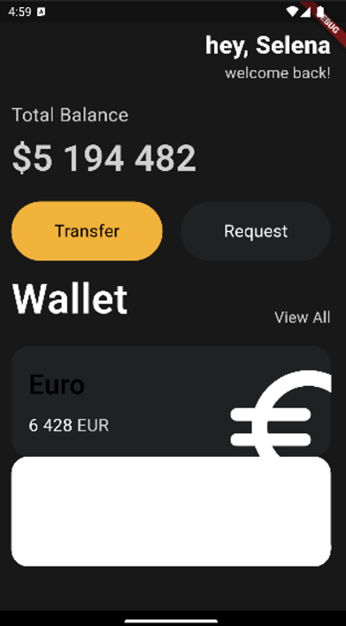

## 플러터 기능 학습



```dart
//main.dart
import 'package:flutter/cupertino.dart';
import 'package:flutter/material.dart';
import 'package:toonprac/widgets/button.dart';
import 'package:toonprac/widgets/card.dart';

void main() {
  runApp(App());
}

class App extends StatelessWidget {
  @override
  Widget build(BuildContext context) {
    return MaterialApp(
      home: Scaffold(
        backgroundColor: Color(0xFF181818),
        body: Padding(
          padding: EdgeInsets.all(20),
          child: Column(
            crossAxisAlignment: CrossAxisAlignment.start,
            children: [
              SizedBox(
                height: 10,
              ),
              Row(
                mainAxisAlignment: MainAxisAlignment.end,
                children: [
                  Column(
                    crossAxisAlignment: CrossAxisAlignment.end,
                    children: [
                      Text(
                        'hey, Selena',
                        style: TextStyle(
                          color: Colors.white,
                          fontSize: 28,
                          fontWeight: FontWeight.w800,
                        ),
                      ),
                      Text(
                        'welcome back!',
                        style: TextStyle(
                          color: Colors.white.withOpacity(0.8),
                          fontSize: 18,
                        ),
                      ),
                    ],
                  ),
                ],
              ),
              SizedBox(
                height: 20,
              ),
              Text('Total Balance',
              style:TextStyle(
                fontSize: 22,
                color: Colors.white.withOpacity(0.8),
              )),
              SizedBox(height: 5,),
              Text('\$5 194 482',
                  style:TextStyle(
                    fontSize: 42,
                    fontWeight: FontWeight.w600,
                    color: Colors.white.withOpacity(0.8),
                  )),
              SizedBox(height: 20,),
              Row(
                mainAxisAlignment: MainAxisAlignment.spaceBetween,
                children: [
                  const Button(text: 'Transfer', bgColor: const Color(0xFFF1B33B),
                      textColor: Colors.black),
                  const Button(text: 'Request', bgColor: const Color(0xFF1F2123),
                      textColor: Colors.white),
                ],
              ),
              const SizedBox(
                height: 10,
              ),
              Row(
                crossAxisAlignment: CrossAxisAlignment.end,
                mainAxisAlignment: MainAxisAlignment.spaceBetween,
                children: [
                  const Text('Wallet',
                  style: TextStyle(
                    color: Colors.white,
                    fontSize: 48,
                    fontWeight: FontWeight.w600,
                  )),
                  Text('View All',
                  style: TextStyle(
                  color: Colors.white.withOpacity(0.8),fontSize: 18,

                  )),
                ],
              ),
              SizedBox(
                height: 20,
              ),
              const Ccard(
                  name: 'Euro',
                  code: 'EUR',
                  amount: '6 428',
                  icon: Icons.euro_rounded,
                isInverted: false,
              ),
              const Ccard(
                name: 'Bitcoin',
                code: 'BTC',
                amount: '9 785',
                icon: Icons.currency_bitcoin,
                isInverted: true,
              ),
            ],
          ),
        ),
      ),
    );
  }
}

```

```dart
// card.dart
import 'package:flutter/material.dart';


class Ccard extends StatelessWidget {

  final String name, code, amount;
  final IconData icon;
  final bool isInverted;

  const Ccard({
    super.key,
    required this.name,
    required this.code,
    required this.amount,
    required this.icon,
    required this.isInverted,
  });


  @override
  Widget build(BuildContext context) {
    return Container(
        clipBehavior: Clip.hardEdge,
        decoration: BoxDecoration(
          color: isInverted ? Colors.white : Color(0xFF1F2123),
          borderRadius: BorderRadius.circular(20),
        ),
        child: Padding(
          padding: const EdgeInsets.all(20),
          child: Row(
            mainAxisAlignment: MainAxisAlignment.spaceBetween,
            children: [
              Column(
                crossAxisAlignment: CrossAxisAlignment.start,
                children: [
                  Text(name,
                    style: TextStyle(
                      color: isInverted ? Colors.white : Colors.black,
                      fontSize: 32,
                      fontWeight: FontWeight.w600,
                    ),
                  ),
                  SizedBox(height: 10,),
                  Row(
                    children: [
                      Text(amount,
                          style: TextStyle(
                            color: Colors.white,
                            fontSize: 20,
                          ) ),
                      SizedBox(width: 5),
                      Text(code,
                          style: TextStyle(
                            color: Colors.white.withOpacity(0.8),
                            fontSize: 20,
                          )
                      ),
                    ],
                  ),
                ],
              ),
              Transform.scale(
                scale: 2,
                child : Transform.translate(
                  offset: Offset(8, 15),
                  child: Icon(
                    icon,
                    color: Colors.white,
                    size: 88,
                  ),
                ),
              )
            ],
          ),
        )
    );

    throw UnimplementedError();
  }
}
```

```dart
//button.dart
import 'package:flutter/material.dart';

class Button extends StatelessWidget {
  final String text;
  final Color bgColor;
  final Color textColor;

  const Button({
    super.key,
    required this.text,
    required this.bgColor,
    required this.textColor,
  });

  @override
  Widget build(BuildContext context) {
    return Container(
        decoration: BoxDecoration(
          color: bgColor,
          borderRadius: BorderRadius.circular(45),
        ),
        child: Padding(
          padding: EdgeInsets.symmetric(
            vertical: 20,
            horizontal: 50,
          ),
          child: Text(
              text,
              style: TextStyle(
                color: textColor,
                fontSize: 20,
              )),
        )
    );

  }
}

```