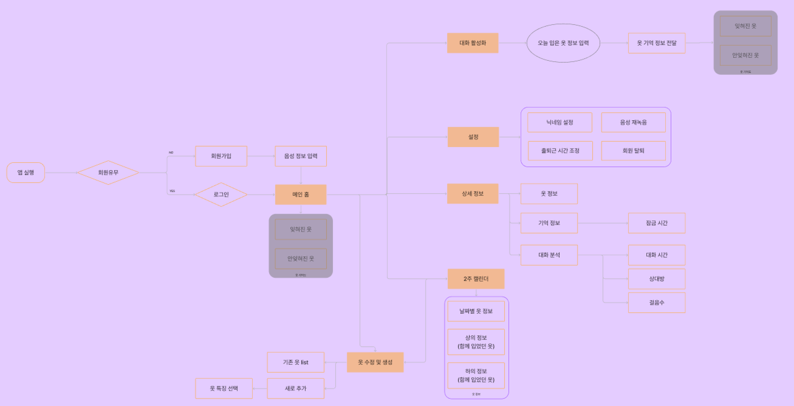
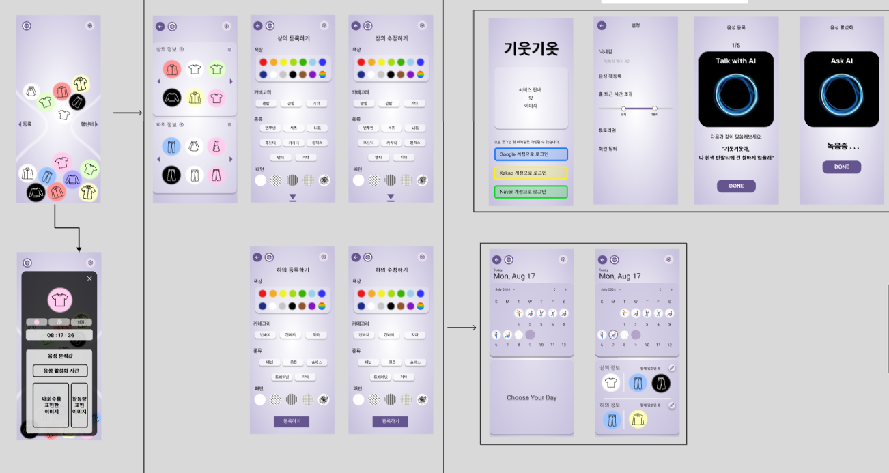

### 1. 유저 플로우 작성

- 상세 화면 분리
    1. 메인 화면에서 이동시 분석값까지 보여주는 상세 화면을 모달 형태로 띄우기
    2. 2주 캘린더에서 이동시 간단한 정보만 보여주는 상세 화면 페이지로 이동
- 상세 화면 정보 대분류 및 키워드 확정 
    1. 옷의 종류
    2. 옷의 색상
    3. 옷의 패턴

### 2. 와이어 프레임 작성

- 컨셉 디자인 확정 : 모래 시계 
    1. 기억하고 있는 옷 (상부)
    2. 기억에서 잊혀진 옷 (하부)
    
- 옷 등록 화면 
    1. 음성 활성화를 통한 옷 등록
    2. 직접 등록 화면으로 이동 

- 직접 등록 및 수정 화면
    1. 등록
        - 기존 옷에서 등록
        - 새로운 등록 ( 키워드로 선택하여 등록 )
    2. 수정
        - 기존 옷에서 수정
        - 수정 (키워드로 선택하여 수정)
    3. 삭제
        - 옷 선택 후 삭제 가능

- 캘린더 화면
    1. 2주 캘린더로 표현
        - 선택시 간단한 정보 표현
        - 수정 화면으로 이동할 수 있도록 버튼 활성화

- 설정 화면
    1. 소셜 로그인에서 가져온 닉네임을 수정 가능하도록 한다.
    2. 출근 시간의 기본값은 9 to 6 이기 때문에, 변경할 수 있도록 한다.
    3. 음성을 재등록할 수 있도록 한다.
    4. 회원 탈퇴 기능

### 고려 사항
1. 설문 조사 결과값 중 브랜드를 표현 및 고려하지 않았다. -> 추후 데이터 베이스 추가 및 와이어프레임 적용 예정

2. PPT 작성 미완료 -> 퇴실 후 계속 진행한다.