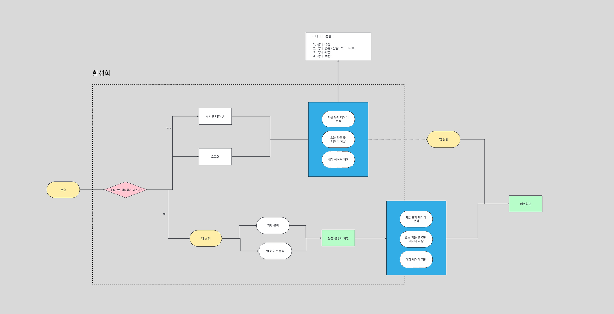
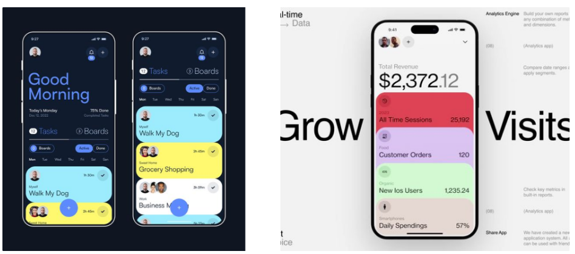

## 1. 사용자 정의

- 연령대 : 20대 ~ 30대
- 대상 : 정해진 시간에 정해진 장소로 출퇴근하는 직장인
- 특징 (출근 하기 전 옷을 고르는 상황 가정)
    - **다른 사람이 나의 옷을 기억한다면 / 내가 최근에 그 옷을 입었다면 똑같은 옷을 입고 싶지 않다.**
        - 나의 옷 데이터를 분석하여 최근에 입은 옷을 피하여 옷을 결정하도록 안내해야 한다.
        - 편리하게 접근하여 내가 입으려는 옷을 결정할 수 있어야 한다.
    - **다른 사람과 같은 옷을 입기 싫다**
        - GPS 데이터를 활용하여야 다른 유저들의 옷 데이터값을 알아야한다.
            
            → 정확한 위치를 실시간 활용하는 것은 지양해야할 것 같다. (프라이버시)
            
            → 유사도 등 그래프, 실시간 이미지 맵 서비스, 텍스트를 활용한 대화 안내 등 대안을 생각해야 한다.
            
        - 옷 데이터 이미지 활용해야 할 수도 있다.

## 2. 서비스 목표 정의

편리하게 음성으로 서비스에 접근하여 내가 지금 입으려는 옷을 결정지을 수 있어야 한다.

## 3. 유저스토리 (활성화 방안)

1. 회원가입 / 로그인
    1. SNS 로그인 
2. 사용자 학습
    1. 사용자 음성 학습
    2. 사용자 얼굴 학습 (갤러리)
3. 메인 화면 
    1. 이전 기록 
    2. 사용자 프로필 (설정)
    3. 
4. 활성화 화면
    1. 실시간 대화형
    2. 로그형 : 기존 사용자의 누적 데이터를 어떻게 보여줘야 할까? 

---

## 4. 레퍼런스

1. 활성화 화면 (대화 + 로그)

2. 대화형 / 로그형

3. 메인 화면 (캘린더)

4. 메인 화면(스택형)
    
    
5. 메인 화면(비주얼 강조)

6. 서브 기능 ( 실시간 사용자 트래킹 ) : 입력 받은 상의와 하의의 색상을 통해 실시간 사용자의 활동량을 보여주는 UI/UX

---

### 생각해야 할 부분

1. 학습 화면의 구성
    1. 사용자 인식 (사용자 얼굴 / 사용자 음성)
    2. 사용자 옷 전체 데이터
2. 메인 화면의 구성
    1. 로고, 프린팅, 패턴 등 상세 정보를 어떻게 표현할 것인가?
    2. 더 자세한 걸 원하면 추가 등록하기
    3. 나의 전체 데이터를 어떻게 표현할 것인가? (팔레트 형식 , 나의 옷 데이터 중 선택 - ex 색상만 ?)