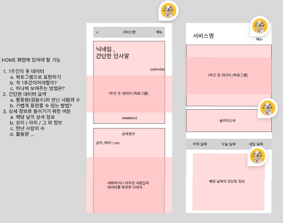
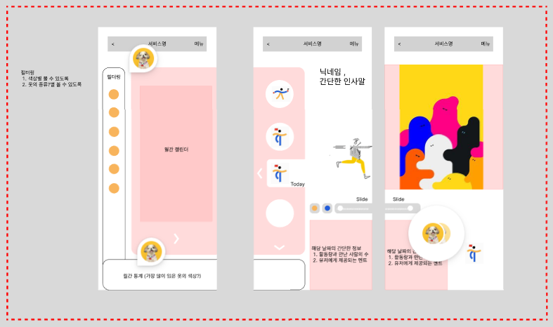
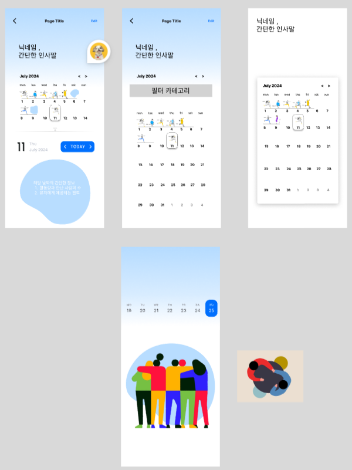
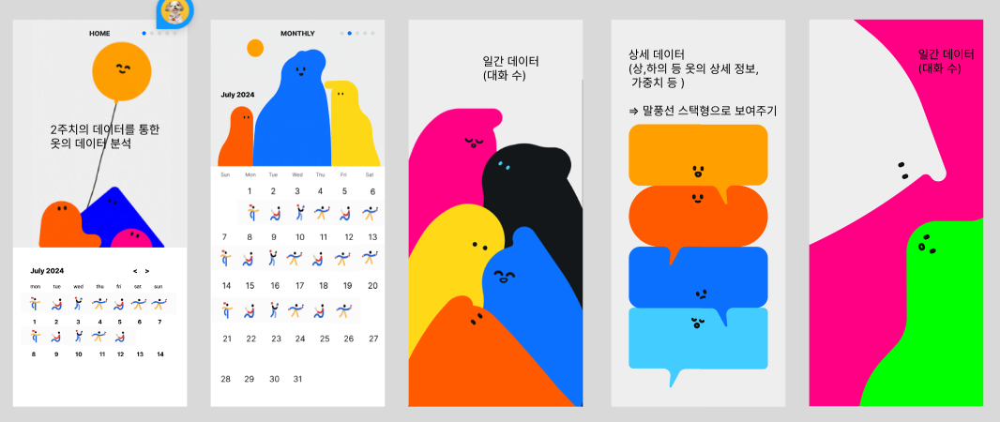

### Concept 정리 (Weekend)
1. 첫번째 시도 : 큰 박스 형태로 레이아웃 잡으려고 했으나 표현이 없어서 이해하기 어려웠다. 

2. 두번째 시도: 내비게이션 바를 없애는 대신 슬라이드 형식으로 진행하였지만, UX 측면에서 아쉬웠다. 또한 너무 많은 정보를 한꺼번에 표현하려고 하는 것 같아서 해당 컨셉은 접기로 했다.

3. 세번째 시도 : 2주 캘린더, 월간 캘린더로 표현해서 이해해보려고 시도
- 픽토그램으로 표현할 수 있는 것이 한정적이라 다른 레퍼런스를 찾아서 진행함.
- 아직 기능 명세서 등을 작성하지 않아서 자세한 내용 작성 부분은 빠졌다. 
- 그래도 표현적인 부분에서 개선이 많이 되었다. 월간 부분이 생각보다 괜찮았다.

### Concept (Today)

1. 팀원들의 피드백 : 사람들로 표현된 부분이 표현력이 약하다고 생각하고, 기능들을 조금 더 구체화해서 표현하도록 맞춰봐야 할 것 같다. 
2. 집중했던 방향 : 캐릭터와 색감으로 표현하려고 노력하였다. 새로운 경험 측면에서는 개선되었다고 생각했지만, 구체적인 앱 레이아웃을 아직 잡지 못했다. 