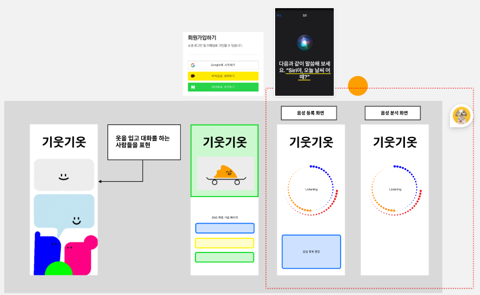
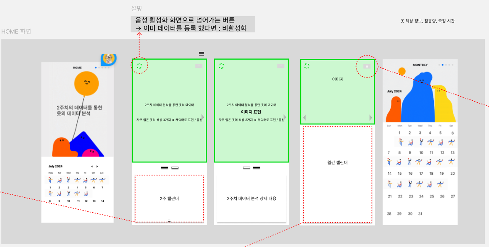
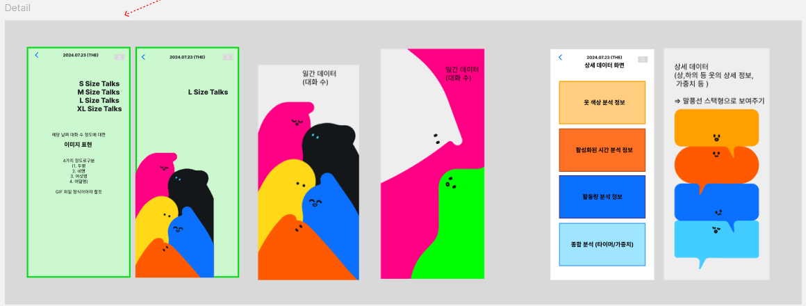
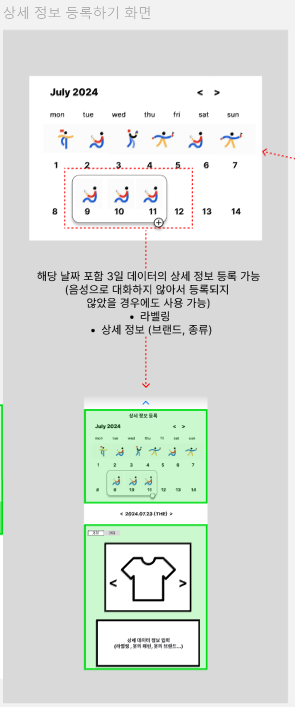
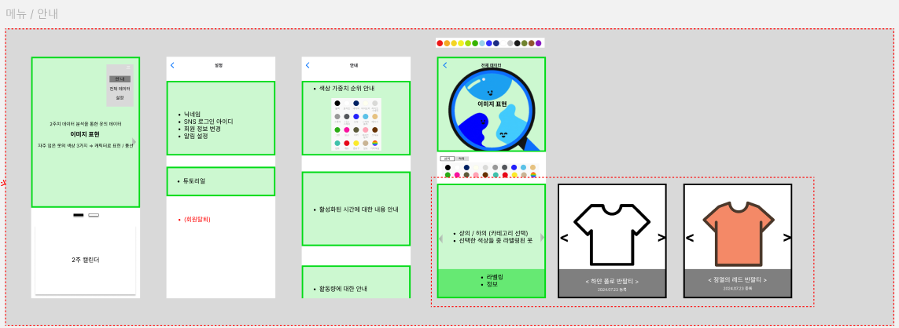

### 기능 1
1. 스플래시 화면
2. SNS 회원가입 화면
3. 음성 활성화 화면 작성

### 기능 2 (HOME 화면)
1. 2주 캘린더 
2. 월간 캘린더
3. 음성 활성화 버튼 
4. 메뉴바 버튼 

### 기능 3 (Detail)
1. 대화량 표현
2. 상세 페이지

3. 상세 정보 등록하기 화면 

### 기능 4(설정 상세 화면)
1. 설정
2. 전체 데이터 
3. 안내

