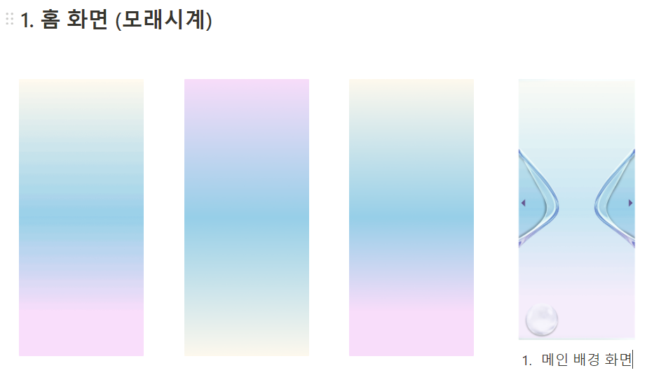
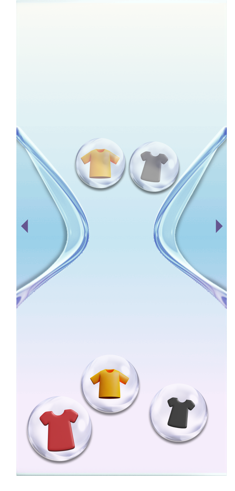

## 1. 오전 회의 피드백

- 홈 화면 (모래시계)

    - 모래 시계로 가되 어떻게 직관적으로 잘 표현할 것인가?

        → 그래서 무엇을 눌러서 확인하고 싶을지 ?

        → 블러 처리

- 백그라운드 이미지 : 색상, 모래시계 구현

- 자이로센서 물리 엔진 구현 확인

- 홈 화면 (아이콘 : 구슬, 옷) : 아이콘 모두 찾아오기

    - 구슬

    - 옷 종류

- 구현

    - 구슬 색상을 어떻게 바꿀 것인가?

    - 구슬을 어떻게 넣을 것인가?

    - 구슬 크기 ?

- 음성 활성화 화면

    - 구현 : 어떤 물리 엔진으로 활성화 화면을 표현할 것인가?

- 플로우 : 튜토리얼 / 옷 등록

- 캘린더 화면

- 2주 캘린더

- 픽토그램

- 위젯 화면 구상하기

    - 오늘 입은 옷을 표현

    - 음성 활성화

    - 플로우별 분리

- 등록 화면

- 서비스 생각하기

## 2. 진행

특별한 재질 표현 , 하나의 색상 표현, 그라데이션 등에서 표현하기 힘들었던 앱이 실행되고 있는 느낌을 살리고 싶었다.

> 구슬 관련 물리 엔진 확인 중 