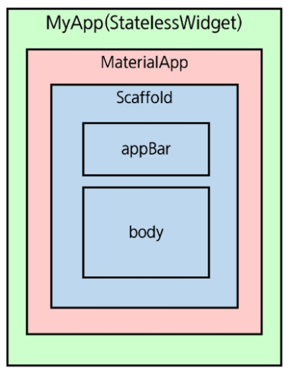

### 플러터 앱 구조

ㄴ .idea : 개발 도구에 필요한 설정

ㄴ android : 안드로이드 프로젝트 관련 폴더

ㄴ ios : ios 프로젝트 관련 폴더

**ㄴlib : 플러터 앱 개발을 위한 다트 작성을 위한 폴더**

ㄴ main.dart : 플러터 앱의 핵심 파일

ㄴ test : 테스트 코드 작성 폴더

 pubspec.yaml : 패키지, 이미지, 폰트 등 설정

.gitignore

.ReadME.md

.metadata : 플러터 SDK 정보

.packages : 플러터 SDK 에 사용하는 기본 정보

.<name>.iml : 개발 도구에 필요한 설정 파일

*자동 생성 (수정X)*

---

### main.dart

```dart
// material 디자인 위젯을 임포트
import 'package:flutter/material.dart';

// App start 부분 (앱의 시작점)
void main() {
  runApp(const MyApp());
}

// 상태가 없는 위젯 : StatelessWidget
// 상태를 가지지 않는다 == 한 번 그려진 후 다시 그려지지 않음
class MyApp extends StatelessWidget {
  const MyApp({super.key});

  // This widget is the root of your application.
  @override
  // build 함수 : 위젯 생성시 호출
  Widget build(BuildContext context) {
    // MaterialApp : title/ theme/home
    // home에 작성되는 위젯이 실제 이 앱에 ㅛ시될 위젯
    return MaterialApp(
      title: 'Flutter Demo',
      theme: ThemeData(
        colorScheme: ColorScheme.fromSeed(seedColor: Colors.deepPurple),
        useMaterial3: true,
      ),
      home: const MyHomePage(title: 'Flutter Demo Home Page'),
    );
  }
}

// StatefulWidget 클래스 : 상태가 있는 위젯을 정의
// 1) 상태 클래스 : 화면에 그려질 코드를 작성
// MyHomePage 기능
class MyHomePage extends StatefulWidget {
  const MyHomePage({super.key, required this.title});

  final String title;

  @override
  State<MyHomePage> createState() => _MyHomePageState();
}

// State 클래스
// 상태를 저장할 변수 + 함수
// MyHomePage에 대한 실제 코드는 여기에 작성됨
class _MyHomePageState extends State<MyHomePage> {
  int _counter = 0;

  void _incrementCounter() {
    // setState 함수 : 화면을 다시 그리는 역할
    setState(() {

      _counter++;
    });
  }

  @override
  Widget build(BuildContext context) {
    // Scaffold 클래스 : 머티리얼 디자인 앱을 만드는데 뼈대가 되는 위젯
    return Scaffold(
      appBar: AppBar(

        backgroundColor: Theme.of(context).colorScheme.inversePrimary,
        title: Text(widget.title),
      ),
      body: Center(
        child: Column(
          mainAxisAlignment: MainAxisAlignment.center,
          children: <Widget>[
            const Text(
              'You have pushed the button this many times:',
            ),
            Text(
              '$_counter',
              style: Theme.of(context).textTheme.headlineMedium,
            ),
          ],
        ),
      ),
      floatingActionButton: FloatingActionButton(
        onPressed: _incrementCounter,
        tooltip: 'Increment',
        child: const Icon(Icons.add),
      ),
    );
  }
}

```

**플러터 앱 실행 구조**



**Scaffold 클래스**

- 머티리얼 앱 구조를 유지하기 위해 사용을 권장함
- appBar
- body
- floatingActionButton
    - onPressed : 버튼이 눌리면 실행되는 부분
    - tooltip : 길게 터치했을 때 표시할 글자 지정
    - child : 버튼에 표시할 아이콘 정의

### 앱 아이콘 (구글 사이트)

[Material Symbols and Icons - Google Fonts](https://fonts.google.com/icons)