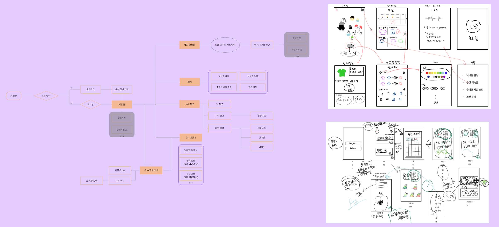
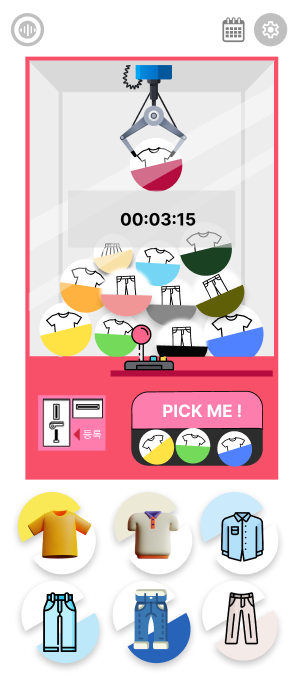

# 2주차
---
# 240715

## 주말 회의 내용

#### 참여자
- 정진영
- 김규림
- 신희진


## 1. 사용자의 입력 줄이기

#### 1) 시간대 설정

##### GPS를 활용해서 회사의 위치를 판단

#### 2) 옷 사진

##### 사진은 찍자..ㅜ

##### 옷을 찍고 중복되지 않게 옷장으로 넣어주기

### 2. 데이터 수집 고려사항

##### 1) 옷의 색상

- 기본 색상(검정,흰색)
- 튀는 색상

##### 2) 옷의 패턴

##### 3) 옷의 조합

##### 4) 옷의 브랜드


#### 목표

기능 생각해보고 관련 기능 구현 알아보기

##### check list

- [x]  프로젝트 목표가 무엇일까?
- [x]  사용자에게 어떤 편의성을 제공할 것인가?


#### 내용

##### 기능 분석

1. **저장 데이터를 활용한 사용자 맞춤형 착장 분석 서비스 (개인)**
    1. 촬영한 사진 데이터 분석
        
        어떻게 분석할 것인가?
        
        - 전체 사진 갤러리형
        - 상의, 하의 분리 후 데이터 처리 (2d로 처리 등)
        - 분석 후 텍스트 데이터
        
        어떤 데이터를 분석할 것인가?
        
        <실시간 데이터> ⇒ 데이터 분류
        
        - 촬영일 (요일)
        - 계절
        - 날씨
        
        <옷 분석 데이터> ⇒ 가중치 분석
        
        - 브랜드 (가격) ?
        - 패턴
        - 악세사리 (모자 등…)
    2. 주간 분석
    3. 월간 분석
    4. 날씨 분석 (기온…)
    
    b~d 분석 → 사용자 맞춤 착장 추천 서비스로 활용할 수 있음
    
2. 음성 및 GPS 데이터 분석
    1. 음성 데이터 분석
        
        누구와, 얼마나 많이 이야기 하였는가?
        
    2. GPS 데이터 분석
        
        어디서 이 옷을 입고 어떤 일정을 소화하였는가?
        
    3. 특별 일정 분석 데이터
        
        평소랑 다른 무엇을 하였는가?
        
    4. 앉고 일어서기 데이터
        
        *앉아있을 때 보다 일어서고 움직일 때 실행할 수 있지 않을까?*
        
3. **GPS 데이터를 활용한 실시간 유저 서비스 (커뮤니티)**
    1. 실시간 다른 유저 착장 분석 서비스


#### Etc.

1. 언제 알림 서비스가 가야하는가?
2. 어떻게 데이터를 처리할 것인가?


#### 회의록

1. 백그라운드와 포그라운드 : 리액트 네이티브
2. 언제 실행해야하는가?
    1. 일주일 기간동안 데이터를 수집해서 사용자 맞춤 시간 설정이 가능하다.
    2. 앉고 일어서기 데이터를 활용할 수 있지 않을까?
3. 결과를 알려줄 때 : 자기 전, 퇴근했을 때 (GPS)
    1. ‘내일은 어떤 옷을 입으실건가요?’
    2. 이 착장은 ~~도시에서 많이 입고 있습니다!


### 2주차 일정

##### 1. ~07.17 : 데이터 수집

##### 2. ~07.15 : 기능 구체화

##### 3. 07.16~07.17 : 레퍼 참고하여 디자인

##### 4. 07.17~07.18 : 기능별 화면(피그마)

##### 5. 07.18~07.19 : 기능 테스트

---
## 오전 회의
#### 참여자
- 정진영
- 김규림
- 신희진
- 류인환
- 이은우
- 이재성

1. **프로젝트의 목표를 확실하게 잡아야 한다.**
    - 타켓층을 확실히 해야 한다.
        - 옷을 입는 것에 신경을 쓰는 사람
        - 직장인
    - 목표
        - 옷 주기 분석을 통한 “이 옷을 언제 또 입어도 되는가?”
    - 
2. **프로젝트 근거를 위한 데이터 수집 기준을 세운다.**
    1. 영상 분석의 기준
        1. 여러 명 가능
        2. 눈동자 트래킹(시선 처리)
        3. 옷에 대한 멘트 분석
            - ‘옷에 뭐 묻었다.’
            - ‘옷이 잘 어울린다.’
    2. 설문 조사 : 영상 분석의 결과를 토대로 설문 조사 (같은 대상)
        1. 설문지를 작성한다. (a번의 결과를 바탕으로)
            - ‘옷의 패턴이 화려할수록 기억이 많이 났나요?’
            - ‘미팅한 상대방의 옷이 기억할 수 있나요?’
    3. 옷에 대한 가설
        1. 브랜드
        2. 색 조합
        3. 패턴
        4. 재질
        5. 디자인
        6. 옷 입는 주기

---

#### 데이터 수집 방법

1. 키에 따른 거리 설정 및 카메라 세팅
    1. 어깨 높이를 기준으로 아래를 보는 것을 옷을 보는 것으로 처리
2. 대화할 때 시선 처리에 대한 데이터 처리
3. 대상자 : 자주 만나는 사람들을 대상으로 시선 분석
4. 여러 사람과 자주 만나기
5. 특정한 사람과 한번 이야기하기
6. 설문조사 : 팀원들의 옷을 얼마나 잘 기억하나요 ? (리포트 대상자가 아니여도 가능)

---

#### 기능

1. 로그인 / 회원 가입
    1. 회원가입
    2. sns 회원가입 / 로그인
2. navigation
    1. 촬영
    2. 캘린더
    3. 실시간 맵
    4. 설정
3. 마이페이지

---
### 메인 서비스의 위험성

- 데이터 수집, 분석시 위험성
- 영상과 음성사이의 상관도가 없다면?
- 생각보다 사람들은 내 옷에 관심이 없다면?
    - 앱을 사용할만한 근거가 있을까?

##### 팀원과 타반 친구사이의 차이

- 컨설턴트님의 옷
- 

### 서브 서비스

- 주변 같은 옷 알림
- 비율
- 활용도
    - 옷에 대한 활용도 알려주기
- 옷과 기분에 대한 분석 - 하루의 기분

#### 앱 필요 서비스

- 알림
- 비율
- 날씨 - 장화
- 위치
- 나만의 옷
- 기록 분석 : 내가 날씨가 맑은 날 이런걸 입었어요. 한달

---
## 컨설턴트님과의 미팅

### 주변에서 내가 입은 옷을 기억하지 못한다면?

- 기억은 안나지만 막상 입고 오면 기억할듯
- 내가 무슨옷을 입었는지 전혀 기억이 안난다에 초점

### 직장인의 음성데이터 보안문제

- 저장을 안하면 괜찮음
- 저장하지 않고 분석으로만 사용하면 됨
- 저장 시 주의하고 허점을 잘 이용하자

### 영상데이터 분석

- 0.000001%의 확률을 위한

### 음성 데이터 분석

- 누구랑은 아니더라도 몇명인지 정도면 괜찮을 듯

### 흔한 코디에 대한 알림정도는 괜찮을 듯

**사용자를 설득하기 위해 해야함**

- 조금이라도 사용자에게 귀찮음이 느껴지면 망할지도
- 사용자에게 가장 주고 싶은 서비스가 무엇인지를 판단하고 그걸 위주로
- 복잡한 사용성
- 피팅에 초점을 맞추지 말것
    - 너무 복잡해질듯
- 우리가 주고자하는 부분이 무엇인지 확실하게 정하고 그 서비스에 집중

### 사용자의 옷을 어떻게 받아올지?

- 내가 옷을 입고난 후 이옷은 안된다라고 주어버리면 절대 안쓸듯

### 오픈된 코디

- 뭔가 아쉬움
- UI적인게 아쉬워보임
- 딱 처음 봤을때 아쉬워보이고, 무엇을 원하는건지 알 수가 없음

### 시간의 기준

- 시간의 기준이 애매하다고 판단
- 장소와 개인적인 판단을 어떻게 판단할 수 있을까?
- 내가 해당 옷을 입고 어딜갔는지 매핑하는건?

### 옷이 있어도 조합하는게 다

- 다른 무언가가 필요해보임

### 아직은 번거러운것도 아니고, 조잡해보이는 것도 아님

- 하지만 무엇을 하려는건지 와닿지가 않음
- 기껏해야 며칠전에 입은옷을 다시 입지 말아라가 끝인 서비스인데
    - 이걸 어떻게 보여주는지는 다르다고 생각함
    - 의지의 차이

너 내일 이거 입지마. 그 이유는 이거야.(우리만의 이유)

- 설명해주는 이유를 어떻게 보여주느냐

### 옷을 등록하고, 이러한 번거러움을 이길만한 앱일까?

### 기능을 분석해주는게 우리가 아직 근거를 찾기 못했기때문

### 너무 기능위주로 빠진 느낌

- 확실한 니즈에 맞는 화면만 주면 되지 않을까?

### 서비스 앱에 대한 아이덴티티를 잡아보자

- 벤치마킹을 더 많이
- 사용자에게 무엇을 주고 싶은지
- 지금은 너무 기능쪽에 치우친느낌
- 좀 더 사용자에게 주고자하는게 무엇인지를 생각해보자.

---
## 하루 요약
1. 기능중심보단 사용자의 사용성 중심으로 생각을 해보자.
2. 사용자를 덜 괴롭히며 새로운 경험을 줄 수 있는 방안에는 무엇이 있을까?
3. 우리의 목표를 분명하게 세운 후 목표를 중점으로 잘 보여줄 수 있는 방법을 생각해보자.


---
---
---
# 240716

## 오늘 팀 회의

<목표 리스트>

1. 데이터 수집
2. 근거를 위한 자료 수집 (인지학, 음성 데이터 활용 등)
3. 레퍼런스 찾기
4. 메인 기능이 무엇일까 정의하기 : 요금제 어플과 같이 명확하게
    1. 무엇을 가장 먼저 보여줘야 할까?
        1. 최근 3일치의 옷을 보여준다.
        2. 가계부처럼 옷에 대한 분석 (색상, 바지 재질)
    2. 음성 데이터에서 가져올 수 있는게 무엇이 있을까?
        1. 대화의 길이
        2. 음성의 세기
        3. 억양과 톤 → 긍정 부정 판별
        4. 대화의 내용 분석 → 필터링이 필요할 것 이다.

### 3팀으로 나눠서 각자 더 세분화해보기
#### 김규림, 정진영
- 옷 + 기억
#### 류인환, 이은우
- 옷 + 음성 분석
#### 이재성, 신희진
- 옷을 사용자에게 효과적으로 보여주기 위한 방안
- 회의 내용
    - 옷 누끼따기 힘듦
    - 상하체 나누기 힘듦
    - 이미지 검색시 정확도가 떨어짐
    - 이것들을 해결할 수 있는 방법이 뭐가 있을까?
---
---
---
# 240717

## 참여자

- 이재성
- 신희진

**회의 요약**

- **naver lens보단**
- **Google lens가 더 정확도가 높음**
- **Google lens를 활용해 간단한 이미지를 가져오는 방법**
- **구현 테스트 해보기**

---

### 팀원과 논의할 사항

- 인터뷰 영상 시선 분석을 위한 코드 조정
- 인터뷰 영상 분석
- 업무와 관련된 내용 분류 기준치 설정
- 옷 특징과 관련된 가중치 기준 정하기
- 온디바이스 활용 방안 찾기
- 와이어프레임 구성
- 4반 한정 설문지 돌리기(컨설턴트님 옷 기준으로 기억하는지)
- 만들어 둔 서베이 돌리기


---
## 오늘 한일

### 1. 김규림, 정진영

- 앱 관련 레퍼런스 참고하여 와이어프레임 구상

### 2. 류인환, 이은우

- 업무와 관련된 내용 분류 기준치 설정
- 옷 특징과 관련된 가중치 기준 정하기

### 3. 신희진, 이재성

- 인터뷰 영상 시선 분석을 위한 코드 조정
- 인터뷰 영상 분석

### 4. 함께

- 4반 한정 설문지 돌리기(컨설턴트님 옷 기준으로 기억하는지)
- 만들어 둔 서베이 돌리기

---

### 컨설턴트님과의 팀 미팅
**일시:** 240717

**참석자:** 컨설턴트님, 코치님, 신희진, 김규림, 정진영, 이재성, 류인환, 이은우

### 1. 설문조사

**질문: 지인, 동료의 옷을 어떻게 기억하십니까?**

- 많이 마주치는 팀원의 옷을 기억하는 비율이 높음
- 해당 결과를 바탕으로 옷에 대한 가중치를 정하기 위한 레퍼런스 찾아보는 중

### 2. 와이어프레임

**질문: 음성데이터 수집에 대해 개인정보와 관련된 건 잘 알아보고 있는가?**

- 온디바이스 형식으로 수집
    - IoT 사용 여부 확인
- 지속적으로 음성 데이터를 받아야 하는 문제에 대한 고민 필요

**3. 위젯에서 음성분석 가능 여부 파악**

- 이후 음성분석을 지속적으로 열어둘 수 있는지 확인

### 4. 외

- 사용자들이 촬영을 하려고 하지 않을 것 같음
- 촬영한 경우 보여주는 방식이나 앱 내 경험을 더 트렌디하게 개선 필요
- 트렌디함을 가져갈 수 있도록

**5.안드로이드 플랫폼을 대상으로 고려하기**

**6. 타겟층 구체화**

- 직장인 대상
- 연령대 및 위치 설정 필요

### 7. 간편하게 옷 정보를 받아오기

- **음성을 통해 옷 정보를 자연스럽게 제공.**
    - 예: "나 오늘 흰색 폴로 반팔니트 입고 싶어."에 대한 반응
- **인스타그램을 통한 옷 정보 제공**
    - 3번 이상 동일한 옷을 입었을 때 짜증 유발 가능성 고려

**8.관리적, 기능적 측면 고려**

- 사용자를 괴롭히지 않고 전문적인 정체성을 유지
- 사진 촬영 없이도 앨범에 접근 가능하게 개선
- 백데이터로 사용자의 옷 데이터를 활용

**9.앱 정확도 및 고려사항**

- 옷 주기에 대한 정확도는 비즈니스 로직으로 처리
    - 100% 정확도보다는 75%의 정확도를 목표로 설정
- 개인정보 중요성 강조
- 범위를 좁혀 핵심 기능의 완성도 우선


---

## 회의록

### 옷 정보 데이터 수집 방식

- 음성 데이터를 활용하여 대화형식으로 옷 정보 수집
    - 색상, 패턴 등 옷의 특징을 활용하여 분석
- 내 갤러리에 접근하여 해당 옷을 찾기
    - 내 얼굴 인식

---

## 17일 이후 일정

### 1. 김규림, 정진영

- 음성 녹음 여부에 따른 각각의 와이어프레임 구상

### 2. 류인환, 이은우

- off 화면에서 녹음 가능 여부 확인
- 화자 분석이 아닌 키워드

### 3. 신희진, 이재성

- 영상 데이터 아이 트래킹 분석
- 새로 수집한 데이터를 토대로 새로운 코드 생성
- 화자분석


---
---
---
# 240718
## 오늘 한일
### 데이터 수집 방식 변경

##### 1. 눈 맞춤 영상 10초

##### 2. 옷 전체 바라보는 영상 10초

##### 3. 대화 영상 3분

#### 분석 방법

- 눈을 바라볼때의 좌표값 범위
- 옷을 바라볼때의 좌표값 범위
- 대화 시 눈 좌표값을 통해 어느곳을 보는지 판단

---
## 제약조건 회의
### 상시 녹음

- 목적에 비해 방법이 비효율적
- 누구랑 대화했는지 알고자 9시간동안 녹음을 한다?
- 녹음이라는 요소가 불편하게 느끼는 사람들이 많을 수도 있음
- 계속 핸드폰을 켜둔다는건 비효율적이다라는 생각이 듦
    - 기획을 듣는 사람 모두가 그렇게 생각(?)

**꼭 음성데이터를 통해서만 누구에게 얼마나 노출했는지를 판단이 가능할까?**

**대화 시간이 아닌 다른 무언가가 있을까?**

**아이디어는 좋은데 방식이 비효율적으로 보임**

### 갤러리 접근 사람 분석

#### 사용자 특정

- 내가 누구인지 사진을 받아야 함
- 가능성있음


---
---
---
# 240719
## 오늘 한일
### 9시간 녹음 가능에 대한 기술적인 문제
- 사용자가 회사내에서 얼마나 대화를 했는가
- 화자인식

### 문제

- 배터리 문제
- 메모리
- 사용관점에서의 불편함
- 강제 종료의 문제

### 대안책을 생각해보자

**어떻게든 옷이라는 주제를 가지고 하려고 하는 모습이 좋았음**

---

### 음성을 활용한 대화형 방식

- 내 옷을 선택하는데 사용하는 것이 아닌 확인정도로 사용하면 재미가 있어 보임
- 음성 어려운길..

### 프론트

- 음성 활성화 화면이 필요할까?
- **프론트 잘 살림**

---
## 해야할 일
- 음성을 통한 화자 분석
    - python 라이브러리(pyAudioAnalysis, librosa)
- 얼굴 인식 코드
    - openCV활용
- 자세 분석 코드 
    - CNN코드 활용
- 영상 분석
    - 눈 좌표 통계
---
---
---

# 240722
---
## 오전 설문조사
##### 프론트 와이어프레임
- 프론트적으로 보여지는게 너무 귀여움
- 옷을 언제입어도 될지에 대한 여부는 음성으로만 진행이 되는것일까?
    - 아니라면 어떻게 화면에 보여줘야할지 함께 고민해보자
## FE 리스트업

1. Home 화면 하단 부분 정보
    1. 어떤걸 보여줘야 하는지?
    2. 얼마나 보여줘야 할까?
2. 캘린더 구현
    1. 방법 : AI 활용하는 방법, 이미지 투명 배경 처리 + 색 입히기
    2. 구현 : 사람 / 캐릭터 (눈사람, 유령 등 꾸밀 수 있는 요소들)

---

## 전체 리스트업

1. **데이터 분석을 위한 기준 및 가설 설정**
2. 기능 명세서
3. ERD 작성
4. 와이어 프레임 작성

---

## 데이터 분석을 위한 기준 및 가설

1. 가중치를 어떻게 설정할 것인가? (근거 데이터)
2. 설문조사 결과를 통한 가설 ?
    1. 어떻게 얼마나 기억하는지? (대상에 대한 옷) → 주기가 중요하다.
        1. 우리반에서만 일단 진행하기. : 팀장의 옷을 기억하시나요?
        2. 범위 넓히기
        3. 주기 기준 세우는 것이 중요하다.

3. 반 사람들을 대상으로 주기별 설문조사(2팀씩, 1~4일까지)
    - 무채색 vs 색상
    - https://www.ncbi.nlm.nih.gov/pmc/articles/PMC3743993/
    - 팀당 한명씩 정해서 사진찍어두기

4. 전체 사람들을 대상으로 옷-기억 관련 설문조사 실행

---

## 음성 분석 코드

### 코드 분석

### `dirMp3toWavWrapper`

폴더 내의 모든 MP3 파일을 WAV 파일로 변환합니다.

### `dirWAVChangeFs`

폴더 내의 모든 WAV 파일의 샘플레이트를 변경합니다.

### `featureExtractionFileWrapper`

단일 WAV 파일에서 중기 및 단기 특징을 추출하고 결과를 파일로 저장합니다.

### `featureExtractionDirWrapper`

폴더 내의 모든 WAV 파일에서 중기 및 단기 특징을 추출합니다.

### `beatExtractionWrapper`

WAV 파일에서 비트를 추출하고, 비트 분당 수(BPM)와 비트 비율을 출력합니다.

### `featureVisualizationDirWrapper`

폴더 내의 WAV 파일들의 특징을 PCA 또는 LDA를 사용하여 시각화합니다.

### `fileSpectrogramWrapper`

WAV 파일의 스펙트로그램을 생성합니다.

### `fileChromagramWrapper`

WAV 파일의 크로마그램을 생성합니다.

### `trainClassifierWrapper`

폴더에 저장된 데이터를 사용하여 분류기를 학습합니다.

### `classifyFileWrapper`

학습된 분류기를 사용하여 단일 파일을 분류하고, 결과를 출력합니다.

### `classifyFolderWrapper`

폴더 내의 모든 파일을 분류하고, 각 클래스의 분포를 출력합니다.

### `trainRegressionWrapper`

폴더에 저장된 데이터를 사용하여 회귀 모델을 학습합니다.

### `regressionFileWrapper`

학습된 회귀 모델을 사용하여 단일 파일을 예측하고, 결과를 출력합니다.

### `regressionFolderWrapper`

폴더 내의 모든 파일을 예측하고, 결과를 출력합니다.

### `trainHMMsegmenter_fromfile`

WAV 파일과 주석 데이터를 사용하여 HMM을 학습합니다.

### `trainHMMsegmenter_fromdir`

폴더 내의 WAV 파일과 주석 데이터를 사용하여 HMM을 학습합니다.

### `segmentclassifyFileWrapper`

학습된 HMM을 사용하여 파일을 세그먼트하고 분류합니다.

### `segmentclassifyFileWrapperHMM`

HMM을 사용하여 파일을 세그먼트하고 분류합니다.

### `segmentationEvaluation`

폴더 내의 파일을 사용하여 세그먼트 분류를 평가합니다.

### `silenceRemovalWrapper`

WAV 파일에서 무음 구간을 제거하고 결과를 별도의 WAV 파일로 저장합니다.

### `speakerDiarizationWrapper`

WAV 파일에서 발화자 분리를 수행하고, 발화자 수와 LDA 사용 여부를 설정할 수 있습니다.

### `thumbnailWrapper`

오디오 파일에서 썸네일을 생성하고, 썸네일 구간을 별도의 WAV 파일로 저장합니다.


```python
from pydub import AudioSegment
import os
import numpy as np
from pyAudioAnalysis import audioSegmentation as aS
from pyAudioAnalysis import audioTrainTest as aT
from pyAudioAnalysis import audioBasicIO

def convert_mp3_to_wav(input_file, output_file):
    """MP3 파일을 WAV 파일로 변환"""
    if not os.path.isfile(input_file):
        raise Exception("Input MP3 file not found!")
    audio = AudioSegment.from_mp3(input_file)
    audio.export(output_file, format="wav")
    print(f"Converted {input_file} to {output_file}")

def speaker_diarization(input_file, num_speakers=2):
    """음성 특징 추출 및 발화자 분리"""
    if not os.path.isfile(input_file):
        raise Exception("Input audio file not found!")
    segments, classes, class_names = aS.speaker_diarization(input_file, num_speakers)
    return segments, classes, class_names

def train_my_voice_model(my_voice_data, model_name="my_voice_model"):
    """내 음성 데이터를 사용하여 모델 학습"""
    if not all(os.path.isdir(folder) for folder in my_voice_data):
        raise Exception("One or more input directories not found!")
    aT.extract_features_and_train(my_voice_data, 1.0, 1.0, aT.shortTermWindow, aT.shortTermStep, "svm", model_name)
    print(f"Trained my voice model and saved as {model_name}")

def classify_my_voice(input_file, model_name="my_voice_model"):
    """학습된 모델을 사용하여 음성 데이터에서 나의 목소리 식별"""
    if not os.path.isfile(model_name):
        raise Exception("Model file not found!")
    if not os.path.isfile(input_file):
        raise Exception("Input audio file not found!")
    results, classes = aT.file_classification(input_file, model_name, "svm")
    return results, classes

def analyze_speech(input_file, my_voice_class, segments, classes):
    """나를 제외한 다른 발화자의 수와 대화 시간 분석"""
    segment_times = np.diff(segments, axis=1).flatten()
    other_speakers = [c for c in set(classes) if c != my_voice_class]
    num_other_speakers = len(other_speakers)

    total_time = sum(segment_times)
    my_voice_time = sum([segment_times[i] for i in range(len(segment_times)) if classes[i] == my_voice_class])
    other_voice_times = {speaker: sum([segment_times[i] for i in range(len(segment_times)) if classes[i] == speaker]) for speaker in other_speakers}

    return num_other_speakers, my_voice_time, other_voice_times

def main():
    input_mp3 = "path/to/your/file.mp3"
    wav_file = "path/to/your/file.wav"
    my_voice_data = ["path/to/my_voice_data"]  # 여기에 내 음성 데이터 경로를 추가

    # MP3 파일을 WAV 파일로 변환
    convert_mp3_to_wav(input_mp3, wav_file)

    # 음성 특징 추출 및 발화자 분리
    segments, classes, class_names = speaker_diarization(wav_file, num_speakers=2)

    # 내 음성 데이터를 사용하여 모델 학습
    train_my_voice_model(my_voice_data)

    # 학습된 모델을 사용하여 음성 데이터에서 나의 목소리 식별
    results, classes = classify_my_voice(wav_file)

    # 나의 목소리 클래스 식별
    my_voice_class = class_names.index("my_voice")  # "my_voice"는 내 목소리 클래스 이름

    # 나를 제외한 다른 발화자의 수와 대화 시간 분석
    num_other_speakers, my_voice_time, other_voice_times = analyze_speech(wav_file, my_voice_class, segments, classes)

    print(f"Number of other speakers: {num_other_speakers}")
    print(f"My voice time: {my_voice_time:.2f} seconds")
    for speaker, time in other_voice_times.items():
        print(f"Speaker {speaker} time: {time:.2f} seconds")

if __name__ == "__main__":
    main()

```
- **`convert_mp3_to_wav`**: MP3 파일을 WAV 파일로 변환합니다.
- **`speaker_diarization`**: 음성 파일에서 발화자 분리를 수행합니다.
- **`train_my_voice_model`**: 내 음성 데이터를 사용하여 모델을 학습합니다.
- **`classify_my_voice`**: 학습된 모델을 사용하여 음성 파일에서 나의 목소리를 식별합니다.
- **`analyze_speech`**: 나를 제외한 다른 발화자의 수와 각 발화자의 대화 시간을 계산합니다.
- **`main`**: 위의 모든 함수를 호출하여 전체 과정을 수행합니다.

---
## 자세 분석 코드
- 걷는것을 판단하기 위한 모델 만들기
- 음성 녹음의 기준을 판단하는것을 나의 움직임과 그 후 내 목소리를 기준으로 진행
- 앉기, 걷기, 서기 정도의 자세 모델이 필요.
- **걷기**가 가장 중요

---
---
---

# 240723
## 와이어프레임 피드백

- 메인 화면 들어가기 전, 튜토리얼
- 현재 서비스가 뭔지 잘 모르겠음
    - 입력받는게 난해함
    - 캐릭터를 직접적으로 달력에 쓰니까 눈에 잘 안들어옴
    - 사용자가 다 눌러서 들어가는 건 귀찮음 ( 절차 너무 많다 )
    - 라벨링 빼도 될 듯
    - 대화량 분석도 자연스럽지 않음
    - “이 옷 당분간 입지마!” 라는 내용이 강하게 드러나야 한다 !!!!!!
    - 기술적인 허들도 많을 서비스
    - 서비스 설득력 X , 방향성 잘못됨
    - 이미지와 텍스트의 나열 X , 어떻게 보여줄 것인가 ?, 서비스 더 생각해보기
    - 단순해도 되니까 원래 서비스의 목적 잊지 않기
- 기능 명세서와 요구 사항 정의의 차이
    - 기능 명세 다시 적고, 일정이랑 우선순위 정해서 내일 다시 미팅
- 일정 정리
    - 이번 주 안에 자세, 음성, 블루투스 끝내기
    - 26일 발표

## 

---

## 아이디어

- 정해야 하는 것
1. 주요 서비스 → ‘이 옷이 사람들 기억에 남았는가?’ 옷에 대한 기억 유무
2. 유저플로우
    1. 위젯
        1. 음성 인식
        2. 오늘 입는 옷에 대한 정보만
        3. 내가 오늘 이 옷을 입어도 되는 지에 대한 판단 (색상, 패턴, 브랜드)
    2. 앱
        1. 음성 제외 나머지 정보 넣기
        2. 목적 : 기억에서 지워진 옷을 보기 위함 ?
        3. 음성으로 받아온 정보를 캘린더로 보여주기 ?
3. 옷 특징 표현 방법
    1. 색
4. 음성 분석
- 홈 화면에서 무엇을 보여줘야 할까?
    - 사진만 안 넣었지, 재고 관리 느낌으로 보여주는 건 똑같음
    - 입어도 된다 / 안 된다 판별?
        - 잊혀졌다 / 안 잊혀졌다 정도만 표현해주기
    - 모래시계 , 구슬
        - 입어도 되는 옷 모래시계 안에서 구슬로 떨어지기 ?
        - 기억 구슬처럼 입어도 되는 거, 안되는 거 따로 보여주기

---
## 파트별 해야할 일
### AI

1. 음성 분석 : 몇 명 + 몇 분동안 ?
2. 음성 분석 : 위젯 → 대화 처리
3. **인터뷰 영상 : 코드 작성 (근거 데이터를 위함) => 이번주 목요일**
4. 자세 인식

### BE

1. **기능명세서 + ERD 작성**
2. 블루투스 서치
3. 백그라운드 활성화
4. 파이썬 자바 통신 구체화 : 자이썬 등 …(ex. 서버 몇 개 띄울지?)

### FE

1. **기능 명세서 작성하기**
2. 와이어 프레임 작성
3. 플러터 익히기

---
---
---
# 240724

## 오전회의

### 요구사항 명세서
| 분류 | 요구사항명 | 기능명 | 상세 설명 |
| --- | --- | --- | --- |
| 사용자 | [기능] 회원관리 | 회원가입&로그인 | 소셜 로그인 (카카오, 네이버, 구글 계정) |
|  |  | 회원 정보 수정 | 출퇴근 시간 조정 (default: 9-18) |
|  |  | 회원 탈퇴 | 회원 탈퇴 (회원 정보 삭제) |
|  | [메인] 옷 기억 서비스 (기억 구슬) | 잊혀진 옷 | 1. 최근에 잊혀진 순서대로 옷을 확인할 수 있다.
(옷의 종류, 색상, 패턴, 브랜드) 
2. 잊혀진 옷의 상세 설명을 확인하고 오늘 입을 옷으로 등록할 수 있다. |
|  |  | 잊혀지지 않은 옷 | 아직 사람들에게 잊혀지지 않은 옷을 확인할 수 있다. (옷의 종류, 색상, 패턴, 브랜드) |
|  | [기능] 옷 등록 (오늘 입을 / 입은옷) | 음성 활성화 | 질문과 대답을 통해 옷을 등록할 수 있다. (옷의 종류, 색상, 패턴, 브랜드) |
|  |  | 사용자 선택 | 1. 사용자가 입었던 옷을 선택할 수 있다.
(옷의 종류, 색상, 패턴, 브랜드에 대한 필터링)
2. 옷의 종류, 색상, 패턴, 브랜드에 대한 키워드를 선택하여 옷을 등록할 수 있다. |
|  | [기능] 캘린더 | 입었던 옷 전체 조회 | 사용자가 입었던 옷을 한 눈에 볼 수 있다.
(월간 캘린더 : 한 달의 데이터를 볼 수 있다.) |
|  |  | 입었던 옷 상세 조회 | 옷 상세 정보를 조회할 수 있다. |
|  |  | 입었던 옷 수정 | 선택한 날짜에 입은 옷 정보를 수정할 수 있다. (옷의 종류, 색상, 패턴, 브랜드) |
|  |  | 입었던 옷 삭제 | 선택한 날짜에 입은 옷을 삭제할 수 있다. |
|  | [기능] 옷 상세 정보 | 해당 옷에 대한 분석값 | 1. 해당 옷에 대한 정보 (옷의 종류, 색상, 패턴, 브랜드)
2. 해당 옷에 대한 분석값 
(얼마나 많은 사람들과 함께 지냈는가? : 대화량, BLE 
   / 얼마나 많이 걸었는가?: 활동량) |


---
### 기능 명세서
| 기능 | 주 기능 | 상세 기능 | 설명 |
| --- | --- | --- | --- |
| 1. 회원관리 | 1-1 회원가입 및 로그인 | 1-1-1. 소셜 로그인 | - 카카오, 네이버, 구글 |
|  |  | 1-1-2. 음성 정보 등록 | - 사용자 음성 정보 등록 |
|  | 1-2 회원정보 수정 | 1-2-1. 기본 정보 수정 | - 닉네임 수정- 근무시간 수정 |
|  |  | 1-2-2. 음성 정보 수정 | - 사용자 음성 재등록 |
|  | 1-3 회원탈퇴 |  | - 사용자 정보 삭제 |
| 2. 데이터 수집 및 분석 | 2-1 데이터 수집 | 2-1-1. 센서 정보 수집 | - 자이로 및 가속 센서 데이터 수집 |
|  |  | 2-1-2. 음성 정보 수집 | - 사용자의 음성을 인식해 음성 데이터 수집 |
|  |  | 2-1-3. 블루투스 정보 수집 | - BLE 서치를 통해 주변 블루투스 기기 정보 수집 |
|  | 2-2 데이터 분석 | 2-2-1. 자세 정보 분석 | - 자이로센서 및 가속센서 정보를 통해 사용자의 움직임 감지- 사용자가 일어나서 걸을 때 음성 인식 활성화 |
|  |  | 2-2-2. 음성 정보 분석 | - 화자 분석을 통해 대화 인원 수 및 대화 시간 측정 |
|  |  | 2-2-3. 블루투스 정보 분석 | - 블루투스 기기 개수와 거리 정보를 통해 주변 인원수 측정 |
| 3. 옷 기억도 | 3-1 옷 기억도 측정 | 3-1-1. 옷 가중치 설정 | - 색상, 패턴 정보, 수집 데이터 분석값을 토대로 옷에 대한 가중치 설정 |
|  |  | 3-1-2. 기억도 계산 | - 옷 가중치와 지난 시간을 기준으로 기억도 계산 |
|  | 3-2 옷 보여주기 | 3-2-1. 잊혀진 옷 보여주기 | - 방식 논의 필요 |
|  |  | 3-2-2. 잊혀지지 않은 옷 보여주기 | - 방식 논의 필요 |
| 4. 옷 정보 관리 | 4-1 옷 정보 입력 | 4-1-1. 음성 대화를 통한 옷 정보 입력 | - 음성 대화를 통해 오늘 입을 옷의 종류, 색상, 패턴 정보 수집- DB 조회 후 해당하는 옷을 오늘 입을 옷으로 등록- DB에 존재하지 않을 경우 DB에 새로 등록후 오늘 입을 옷으로 등록 |
|  |  | 4-1-2. 입을 옷 등록 | - 날짜 선택- 입었던 옷 조회 후 리스트에서 선택- 색상, 종류, 패턴을 기준으로 필터링 가능- 리스트에 없을 경우 직접 입력(DB에 등록) |
|  | 4-2 옷 정보 수정 | 4-2-1. 옷 정보 수정 | - 특정 날짜에 입었던 옷을 같은 방식으로 수정 |
| 5. 캘린더 | 5-1 날짜별 옷 정보 조회 | 5-1-1. 월별 전체 조회 | - 캘린더에 날짜별 입었던 옷 정보를 색상으로 표현 |
|  |  | 5-1-2. 날짜별 상세 데이터 조회 | - 캘린더에서 날짜 클릭 시 입은 옷 정보 및 해당 날짜의 분석값 전달- 등록 및 수정 화면으로 이동 |

---

##### 순서 : 와이어프레임 → 유저플로우 → 기능 명세서 → API 명세서 / ERD

---

# 우선순위

1. 유저플로우 (~7.25 오전)
2. 와이어프레임 (~7.25 오전)
    1. 5개 : 메인 페이지 / 음성 활성화 / 캘린더 / 옷 상세 정보 화면 / 상세 정보 CRUD

→ 7.25 까지 각자 생각해오고 오전에 마무리

1. 중간 발표 준비 : 기획 근거, 근거 자료, 내용 정리, 발표 준비, 화면 구성 / 디자인(~7.25)

---

# 화면 별 기능

## 1. 메인 페이지

- 기억에 남아있는 옷
- 기억에 남아있지 않은 옷
- 옷 수정할 수 있도록
- 음성 활성화

## 2. 캘린더

- 월간 / 2주치
- 내가 무슨 옷을 입었는지에 대한 데이터
- 데이터에 대한 분석값 (캘린더 클릭 ?)
- 간단한 상세 정보

## 3. 옷 상세 정보

- 그날 입은 옷에 대한 정보 (색상, 패턴, 종류)
- 분석값을 여기에다 넣어도 될 듯

## 4. 상세 정보 CRUD

- 옷 상세 정보 화면과 비슷하게 구성
- 기존에 입은 옷 수정
- 새로운 옷 생성 - 팔레트, 키워드 등 사용자 선택 받기

## 5. 음성 활성화

## 6. 설정

- 회원 정보 수정
- 회원 탈퇴
- 튜토리얼
    - 우리의 음성 데이터는 텍스트화 안된다는 걸 말해주기!

---

## 3주차

- 프 : 유저플로우, 와이어프레임 구체화 / 개발 환경 세팅 / 플러터 학습
- 백 : erd 마무리 / 프로젝트 세팅 / 개발 환경 세팅 / API 명세서

## 4주차

- 프 : 메인 페이지 / 음성 활성화
- 백 : 목업 작업 마무리
- Ai : 음성, 옷 가중치, 자세 인식 마무리 ( ~ 7.30.화 )

## 5주차

- 프 : 캘린더 / 옷 상세 정보 화면 / 상세 정보 CRUD
- 백 :

## 6주차

- 프 : 디자인 끝 / CSS
- 백 : 배포, 테스트, 디버깅


---
---
---
# 240725

## 첫 유저플로우, 와이어프레임

## 최종 와이어프레임

---
### 영상 분석
- 대화 시 옷과 눈을 바라보는 % 계산

- 60분을 기준으로 시간별 시선분석
---

---
---
---
# 240726
## 아이트래킹 코드
```python
import numpy as np
import cv2


name = "규림"
# 얼굴 및 눈 검출을 위한 Haar Cascade 로드
face_cascade = cv2.CascadeClassifier(cv2.data.haarcascades + 'haarcascade_frontalface_default.xml')
eye_cascade = cv2.CascadeClassifier(cv2.data.haarcascades + 'haarcascade_eye.xml')

# 좌표 범위를 계산하는 함수
def calculate_bounding_box(video_path):
    cap = cv2.VideoCapture(video_path)
    min_x, min_y = float('inf'), float('inf')
    max_x, max_y = 0, 0

    while cap.isOpened():
        ret, frame = cap.read()
        if not ret:
            break

        gray = cv2.cvtColor(frame, cv2.COLOR_BGR2GRAY)
        faces = face_cascade.detectMultiScale(gray, 1.3, 5)

        for (x, y, w, h) in faces:
            roi_gray = gray[y:y + h, x:x + w]
            eyes = eye_cascade.detectMultiScale(roi_gray)
            for (ex, ey, ew, eh) in eyes:
                eye_gray = roi_gray[ey:ey + eh, ex:ex + ew]
                _, thresholded = cv2.threshold(eye_gray, 70, 255, cv2.THRESH_BINARY_INV)
                thresholded = cv2.medianBlur(thresholded, 5)
                contours, _ = cv2.findContours(thresholded, cv2.RETR_TREE, cv2.CHAIN_APPROX_SIMPLE)
                if contours:
                    max_contour = max(contours, key=cv2.contourArea)
                    if cv2.contourArea(max_contour) > 10:
                        M = cv2.moments(max_contour)
                        if M['m00'] != 0:
                            cx = int(M['m10'] / M['m00'])
                            cy = int(M['m01'] / M['m00'])
                            min_x, min_y = min(min_x, cx), min(min_y, cy)
                            max_x, max_y = max(max_x, cx), max(max_y, cy)

    cap.release()
    return (min_x, min_y, max_x, max_y)

# 눈과 옷 영상을 분석하여 좌표 범위를 계산
eye_bounding_box = calculate_bounding_box(f'C:/Users/SSAFY/Desktop/gugu/Proctoring-AI/Interview/눈/{name}.mp4')
clothes_bounding_box = calculate_bounding_box(f'C:/Users/SSAFY/Desktop/gugu/Proctoring-AI/Interview/옷/{name}.mp4')

# 대화 영상을 분석하여 동공이 눈 또는 옷 박스 안에 있는지 확인합니다.
def analyze_gaze(video_path, eye_box, clothes_box):
    print("눈------------------------------------------")
    print(eye_box)
    print("옷----------------------------------------")
    print(clothes_box)
    cap = cv2.VideoCapture(video_path)
    eye_count, clothes_count, total_count = 0, 0, 0

    while cap.isOpened():
        ret, frame = cap.read()
        if not ret:
            break

        gray = cv2.cvtColor(frame, cv2.COLOR_BGR2GRAY)
        faces = face_cascade.detectMultiScale(gray, 1.3, 5)

        for (x, y, w, h) in faces:
            roi_gray = gray[y:y + h, x:x + w]
            roi_color = frame[y:y + h, x:x + w]  # 색상 영역 추가
            eyes = eye_cascade.detectMultiScale(roi_gray)
            for (ex, ey, ew, eh) in eyes:
                eye_gray = roi_gray[ey:ey + eh, ex:ex + ew]
                eye_color = roi_color[ey:ey + eh, ex:ex + ew]
                _, thresholded = cv2.threshold(eye_gray, 70, 255, cv2.THRESH_BINARY_INV)
                thresholded = cv2.medianBlur(thresholded, 5)
                contours, _ = cv2.findContours(thresholded, cv2.RETR_TREE, cv2.CHAIN_APPROX_SIMPLE)
                if contours:
                    max_contour = max(contours, key=cv2.contourArea)
                    if cv2.contourArea(max_contour) > 10:
                        M = cv2.moments(max_contour)
                        if M['m00'] != 0:
                            cx = int(M['m10'] / M['m00'])
                            cy = int(M['m01'] / M['m00'])
                            total_count += 1
                            if eye_box[0] <= cx <= eye_box[2] and eye_box[1] <= cy <= eye_box[3]:
                                eye_count += 1
                            elif clothes_box[0] <= cx <= clothes_box[2] and clothes_box[1] <= cy <= clothes_box[3]:
                                clothes_count += 1
                            # 동공 위치에 노란색 원 그리기
                            # cv2.circle(eye_color, (cx, cy), 5, (0, 255, 255), -1)
                            # print('위치',cx,cy)

        # 결과를 표시
        # cv2.imshow('frame', frame)
        if cv2.waitKey(1) & 0xFF == ord('q'):
            break

    cap.release()
    cv2.destroyAllWindows()
    
    eye_ratio = eye_count / total_count if total_count > 0 else 0
    clothes_ratio = clothes_count / total_count if total_count > 0 else 0
    return eye_ratio, clothes_ratio,eye_count,clothes_count,total_count

# 대화 영상을 분석하여 눈과 옷을 얼마나 보는지 판단
eye_ratio, clothes_ratio,eye_count,clothes_count,total_count = analyze_gaze(f'C:/Users/SSAFY/Desktop/gugu/Proctoring-AI/Interview/대화/{name}.MOV', eye_bounding_box, clothes_bounding_box)

print(f"눈을 본 비율: {eye_ratio * 100}%")
print(f"옷을 본 비율: {clothes_ratio * 100}%")
print(f"눈을 본 횟수: {eye_count}번")
print(f"옷을 본 횟수: {clothes_count}번")
print(f"전체: {total_count}번")

```
## 결과
| 이름 | 시간(분) | 눈 비율 | 옷 비율 |
| --- | --- | --- | --- |
| 이재성 | 5 | 91.16% | 8.80% |
| 이재성 | 15 | 92.80% | 7.19% |
| 이재성 | 30 | 75.00% | 24.86% |
| 김규림 | 5 | 51.11% | 47.82% |
| 김규림 | 10 | 37.73% | 54.94% |
| 김규림 | 15 | 38.46% | 60.73% |
| 정진영 | 5 | 94.66% | 5.15% |
| 정진영 | 10 | 95.23% | 4.59% |

---
**질문 목록**

Q. 옷이 사람들의 기억에 남아있는 것을 부정적으로 본다는건지? 기억에 남아있는것이 가지는 의미를 잘 모르겠습니다.

Q. 어떠한 유저플로우로 서비스를 사용할 수 있는지 궁금합니다.

Q. 가중치에 대한 근거를 어떻게 설정할 것인지 궁금합니다.

Q. 옷을 단순히 입지 말라고 하는 것이 얼마나 필요한 기능인지 잘 와닿지 않습니다. 차라리 옷을 추천해주는 서비스인게 낫지 않을까요…?

Q. 음성말고 다른 방법으로 등록할 때, 내 옷장에 있는 옷들을 미리 등록시켜놔야하는건가요

---

기옷기옷 중간 발표 Q&A

- 옷이 사람들의 기억에 남으면 무엇이 좋은거냐 ? 서비스 목적?
    
    특징있는 옷을 언제 입어도 되는거냐 를 나타내는 것
    
- 실제로 사용한다면 어떻게 사용하게 될 지 설명 부탁
    
    음성활성화, 입을 옷 등록, 캘린더
    
- 자세, 시선 데이터 수집 부분 어디에서 사용되는지 ?
    
    일어섰을때 사람들의 옷 많이 볼 것이라고 생각
    
    실제 앱에서는 해당 데이터 사용 X
    
- 대화를 하는 상대방의 목소리 녹음은 문제가 되지 않나 ?
    
    전체음성을 텍스트화 X, 누구인지만 화자분석
    
- 기억에 잊혀졌는지, 안잊혀졌는지 판단 기준은 ?
    
    명도, 채도 강하면 사람들 기억에 오래 남을 것이라 생각
    
- 이 앱은 이용자가 오늘 뭐 입지에 대한 답을 찾기 위함인데 내가 답을 먼저 찾고 그걸 ai에게 확인하는 느낌아닌가 ?
    
    어떤 옷을 입지 말아야 할까가 우리 앱의 중점임
    

---

컨설턴트님 피드백

- 직장인들의 옷 결정 스트레스다 ! 앱 사용할 듯!
- 과학적인 근거가 있다면 그 가중치를 보여주는게 재밌을 것 같음
- ui/ux 아직 아쉬움 → 등록 화면 불편
- 위젯에 내가 오늘 입고 있는 옷 간단하게 보여주기 ?

---

개인적인 피드백

- 우리의 주 서비스가 옷에 대한 기억력인데 그 부분이 생각보다 어필이 덜 된 것 같아서 아쉬웠다ㅜ
    - 페르소나를 매일매일 다른 옷을 입는 기분을 느끼길 원하는 직장인~ 같이 기억력 위주로 구체화 해야할 것 같다
    - 가중치를 정하는 근거에 대해서도 좀 더 중점을 두고 발표하면 더 어필이 잘 될 것 같다! (ex : 활동량이 많을 수록 많은 사람을 만나서 더 많은 사람의 기억에 오래 남을것 같아서 활동량을 가중치 근거로 넣었다)
- 최종 발표 준비 기간을 넉넉하게 잡아서 같이 발표 들어보고 발표내용 같이 완성해주기~


---
## 일정관리 간트차트 주소
**https://docs.google.com/spreadsheets/d/1XHxqbATuQjaIxjweTUsKZiCwHGL0CrEJt4XBOCUo2Y0/edit?usp=sharing**

---
---
---
# 240729
## 주말 프론트 회의
### 프론트 메인화면 구상

---

## 사용자 앨범 접근 유무

- 앨범에 접근하여 색만 가져온다?
    - 접근하는데 아쉬움이 있음
- 일정을 먼저 정해보자

---
---
---
---
#### 0729 논의 내용

- 대화형 기능을 위한 키워드 설정
    - `colors = { '빨간색': (255, 0, 0), '파란색': (0, 0, 255), '노란색': (255, 255, 0), '초록색': (0, 255, 0), '검은색': (0, 0, 0), '흰색': (255, 255, 255), '핑크': (255, 192, 203)
    }
    types = ['니트', '셔츠', '반팔', '긴팔', '코트', '재킷']
    patterns = ['스트라이프', '체크', '도트', '플라워']`

---
## 와이어프레임 피드백

- 유저 플로우의 화면 흐름이 안보임
- 등록은 왜 해?
    - 등록 자체를 빼는게 좋아보임
    - 사용자를 왜 괴롭히려고 하는 건지 이해가 불가능
- 사용자가 내 옷을 등록하는 순간 망한다고 생각함
- 둘 중 하나
    - 컨텐츠 - 사용자가 정말 쓰고 싶게 해야 함
    - 편함 - 사용자가 쓰기 편함
- 음성 등록도 애매함
- 옷의 정보가 없는 서비스는?
- 모래시계 알고 보면 보이지만, 유저에게 바로 의미가 보일까?
    - 재미있게 보여주기. 현재 직관적이지는 않음
- 디자인 완성 X - 굳이 보라색 톤?
- 라이트하게 “ 입지마라!“만을 표현했으면
    - 기술적인 시도, 트렌디함 추구
    - 왜 등록해야해 ????????
- 인형 뽑기 메인 화면
    - “입어도 되는 옷들 중에서 오늘 입을 옷 하나 골라줘” 정도의 느낌임
    - 서브 기능으로는 괜찮지만 메인으로는 X
- 우리가 왜 이걸 해야 하는지 ?
- **모래시계**
    - 흔들림이 필수
- 내가 가지고 있는 옷을 보여준다면 최고
- 내가 가지고 있는 옷에 대한 메타 데이터를 추가로 보여준다면 더 좋을 것 같음
- 등록 화면
    - 팔레트 나오는 방식
        - 팔레트가 펼쳐지면서 사용자가 선택하는 액션 ?
        - 지금은 너무 일하는 느낌. 사용자가 안 쓸 듯
        - 간단한 터치 정도의 수준으로 수정
        - 어떻게 그날 입은 옷을 캐치할 수 있을까? 등록말고ㅠ
        - 편한 등록 방법을 찾아보자,,,,,

---

- 모래 시계 위가 잊혀지지 않은 옷이라는 걸 더 확실하게 어떻게 보여줄지 ?
- 배경색 ?
- 등록 방법 ?
- 음성 등록과 팔레트에서 색 선택 ?
- 홈화면 / 등록화면

---
---
---
---
# 240730
## 음성 분석
- 화자 분석
- 내 목소리 분석 정확도 향상 필요
- 화자 분리 필요
- 시간을 얼마나 투자해야할지 일정 정리
```python
import subprocess
import os
import numpy as np
import librosa
from pydub import AudioSegment
from sklearn.mixture import GaussianMixture
from sklearn.preprocessing import StandardScaler
from scipy.spatial.distance import cosine
from sklearn.cluster import KMeans
from sklearn.metrics import silhouette_score
import matplotlib.pyplot as plt
from scipy.spatial.distance import euclidean
from fastdtw import fastdtw

path = "C:/Users/SSAFY/Desktop/test/data/"

# ffmpeg 경로 설정
AudioSegment.converter = "C:/ffmpeg-master-latest-win64-gpl/bin/ffmpeg.exe"
AudioSegment.ffprobe = "C:/ffmpeg-master-latest-win64-gpl/bin/ffprobe.exe"

def convert_to_wav(input_path, output_path):
    if os.path.exists(input_path):
        command = f"C:/ffmpeg-master-latest-win64-gpl/bin/ffmpeg.exe -y -i {input_path} {output_path}"
        subprocess.call(command, shell=True)
    else:
        print(f"Error: Input file {input_path} does not exist.")

def clean_audio(y):
    y = np.nan_to_num(y)  # NaN 값을 0으로 변환
    y[np.isinf(y)] = 0  # 무한대 값을 0으로 변환
    return y

def extract_features(y, sr, n_mfcc=20, n_fft=2048):
    y = clean_audio(y)  # NaN과 무한대 값 제거
    if len(y) < 2048:  # 최소 신호 길이를 보장
        y = np.pad(y, (0, 2048 - len(y)), 'constant')

    n_fft = min(n_fft, len(y))  # n_fft 값을 신호 길이에 맞게 조정

    mfccs = librosa.feature.mfcc(y=y, sr=sr, n_mfcc=n_mfcc, n_fft=n_fft)
    chroma = librosa.feature.chroma_stft(y=y, sr=sr, n_fft=n_fft)
    mel = librosa.feature.melspectrogram(y=y, sr=sr, n_fft=n_fft)
    contrast = librosa.feature.spectral_contrast(y=y, sr=sr, n_fft=n_fft)
    tonnetz = librosa.feature.tonnetz(y=librosa.effects.harmonic(y), sr=sr)
    zcr = librosa.feature.zero_crossing_rate(y, frame_length=n_fft)
    rms = librosa.feature.rms(y=y, frame_length=n_fft)

    features = np.hstack([
        np.mean(mfccs.T, axis=0),
        np.std(mfccs.T, axis=0),
        np.mean(chroma.T, axis=0),
        np.std(chroma.T, axis=0),
        np.mean(mel.T, axis=0),
        np.std(mel.T, axis=0),
        np.mean(contrast.T, axis=0),
        np.std(contrast.T, axis=0),
        np.mean(tonnetz.T, axis=0),
        np.std(tonnetz.T, axis=0),
        np.mean(zcr.T, axis=0),
        np.std(zcr.T, axis=0),
        np.mean(rms.T, axis=0),
        np.std(rms.T, axis=0)
    ])

    return features.flatten()

def extract_features_from_multiple_files(file_list):
    all_features = []
    for file in file_list:
        y, sr = librosa.load(file)
        y = clean_audio(y)
        features = extract_features(y, sr)
        all_features.append(features)

    all_features = np.array(all_features)
    mean_features = np.mean(all_features, axis=0)
    return mean_features

def segment_features(features, segment_size=50):  # 세그먼트 길이를 줄임
    num_segments = features.shape[0] // segment_size
    segments = np.array([features[i * segment_size: (i + 1) * segment_size] for i in range(num_segments)])
    return segments

def find_optimal_clusters(data, max_k):
    iters = range(2, max_k + 1, 2)
    sse = []
    silhouettes = []

    for k in iters:
        kmeans = KMeans(n_clusters=k, random_state=42).fit(data)
        sse.append(kmeans.inertia_)
        score = silhouette_score(data, kmeans.labels_)
        silhouettes.append(score)

    f, (ax1, ax2) = plt.subplots(1, 2, sharey=True)
    ax1.plot(iters, sse, '-o')
    ax1.set_xlabel('Cluster Centers')
    ax1.set_ylabel('SSE')
    ax2.plot(iters, silhouettes, '-o')
    ax2.set_xlabel('Cluster Centers')
    ax2.set_ylabel('Silhouette Score')
    plt.show()

    best_k = iters[silhouettes.index(max(silhouettes))]
    return best_k

def cluster_segments(segments, num_clusters=2):
    if len(segments) < num_clusters:
        raise ValueError(f"n_samples={len(segments)} should be >= n_clusters={num_clusters}.")
    
    kmeans = KMeans(n_clusters=num_clusters)
    segments_flattened = segments.reshape(segments.shape[0], -1)
    labels = kmeans.fit_predict(segments_flattened)
    return labels, kmeans.cluster_centers_

def calculate_speaker_times(labels, segment_size, sr):
    unique_labels = np.unique(labels)
    speaker_times = {label: 0 for label in unique_labels}
    for label in labels:
        speaker_times[label] += segment_size / sr
    return speaker_times

def filter_non_speech_frames(y, sr, rms_threshold=0.03):
    # RMS 값 계산
    rms = librosa.feature.rms(y=y)[0]

    # 각 RMS 프레임의 길이 계산
    frame_length = int(len(y) / len(rms))

    # RMS 값 배열을 원래 오디오 배열 길이에 맞게 확장
    expanded_indices = np.repeat(rms < rms_threshold, frame_length)

    # 확장된 인덱스가 원래 오디오 배열보다 길면 자르기
    if len(expanded_indices) < len(y):
        expanded_indices = np.append(expanded_indices, np.zeros(len(y) - len(expanded_indices), dtype=bool))
    elif len(expanded_indices) > len(y):
        expanded_indices = expanded_indices[:len(y)]

    filtered_y = y[~expanded_indices]
    return filtered_y

def identify_speakers(audio_path, my_voice_features, threshold=30.0):
    y, sr = librosa.load(audio_path)
    y = clean_audio(y)  # NaN과 무한대 값 제거
    y = filter_non_speech_frames(y, sr)  # 비음성 프레임 제거

    intervals = librosa.effects.split(y, top_db=20)
    speaker_features = []
    speaker_times = []

    for interval in intervals:
        start, end = interval
        segment = y[start:end]
        features = extract_features(segment, sr)
        speaker_features.append(features)
        speaker_times.append((start, end))

    if len(speaker_features) < 2:
        print("Not enough segments to cluster.")
        return 0, sum((end - start) / sr for start, end in speaker_times), 0

    speaker_features = np.array(speaker_features)
    scaler = StandardScaler()
    speaker_features = scaler.fit_transform(speaker_features)

    best_k = find_optimal_clusters(speaker_features, max_k=10)
    print(f"Optimal number of clusters: {best_k}")

    labels, centers = cluster_segments(speaker_features, num_clusters=best_k)

    my_voice_time = 0
    other_speaker_time = 0
    speaker_durations = {i: 0 for i in range(best_k)}

    for sf, (start, end), label in zip(speaker_features, speaker_times, labels):
        duration = (end - start) / sr
        sf_flat = sf.flatten()
        my_voice_flat = my_voice_features.flatten()

        distance, _ = fastdtw(sf_flat.reshape(-1, 1), my_voice_flat.reshape(-1, 1), dist=euclidean)
        print(f"Segment distance: {distance}, Duration: {duration}, Label: {label}")
        if distance < threshold:
            my_voice_time += duration
        else:
            speaker_durations[label] += duration

    other_speakers_time = sum(speaker_durations.values())

    return my_voice_time, other_speakers_time, len(np.unique(labels)) - 1

# GMM 모델 훈련
def train_gmm_model(file_paths, n_components=16):
    features = []
    for file_path in file_paths:
        y, sr = librosa.load(file_path, sr=None)
        feature = extract_features(y, sr)
        features.append(feature)
    
    features = np.array(features)
    scaler = StandardScaler()
    features = scaler.fit_transform(features)

    n_components = min(len(features), n_components)  # 데이터 포인트 수 이하로 설정
    
    gmm = GaussianMixture(n_components=n_components, covariance_type='diag', n_init=3)
    gmm.fit(features)
    
    return gmm, scaler, features

def recognize_speaker(gmm, scaler, test_file):
    y, sr = librosa.load(test_file, sr=None)
    features = extract_features(y, sr)
    features = scaler.transform([features])
    score = gmm.score(features)
    
    return score

def extract_i_vector(y, sr, gmm, ubm):
    features = extract_features(y, sr).reshape(1, -1)  # features의 형태를 (1, n_features)로 변경
    post = gmm.predict_proba(features)
    N = np.sum(post, axis=0)
    F = np.dot(post.T, features) - N[:, np.newaxis] * ubm.means_
    T_inv = np.linalg.inv(np.dot(ubm.means_.T, ubm.means_))
    i_vector = np.dot(T_inv, F.T)
    return i_vector.flatten()

def cosine_similarity(v1, v2):
    return 1 - cosine(v1, v2)

def main():
    conversation_files = [
        path + "conversation6.m4a"
    ]
    
    my_voice_files = [
        path + "js_01.m4a",
        path + "js_02.m4a",
        path + "js_03.m4a",
        path + "js_04.m4a",
        path + "js_05.m4a",
        path + "js_06.m4a",
    ]

    # my_voice_files를 wav로 변환
    my_voice_wavs = [file.replace('.m4a', '.wav') for file in my_voice_files]
    for m4a, wav in zip(my_voice_files, my_voice_wavs):
        convert_to_wav(m4a, wav)

    # 여러 파일에서 특징 추출
    my_voice_features = extract_features_from_multiple_files(my_voice_wavs)

    # GMM 모델 훈련
    gmm_model, scaler, features = train_gmm_model(my_voice_wavs)
    
    total_other_speakers = set()
    total_conversation_time = 0

    for conv_file in conversation_files:
        wav_file = conv_file.replace('.m4a', '.wav')
        convert_to_wav(conv_file, wav_file)

        my_voice_time, other_time, other_speakers = identify_speakers(wav_file, my_voice_features)

        total_other_speakers.update(range(other_speakers))
        total_conversation_time += other_time

        # GMM 모델을 사용하여 스피커 인식
        score = recognize_speaker(gmm_model, scaler, wav_file)
        print(f"Recognition score for {os.path.basename(conv_file)}: {score}")

        # I-vector 추출 및 유사도 계산
        test_i_vector = extract_i_vector(librosa.load(wav_file)[0], librosa.load(wav_file)[1], gmm_model, ubm)
        similarities = [cosine_similarity(train_iv, test_i_vector) for train_iv in train_i_vectors]
        print(f"Cosine similarities for {os.path.basename(conv_file)}: {similarities}")

        print(f"File: {os.path.basename(conv_file)}")
        print(f"My voice time: {my_voice_time:.2f} seconds")
        print(f"Other speakers time: {other_time:.2f} seconds")
        print(f"Number of other speakers: {other_speakers}")
        print()

    print(f"Total number of other speakers across all conversations: {len(total_other_speakers)}")
    print(f"Total conversation time (excluding my voice): {total_conversation_time:.2f} seconds")

if __name__ == "__main__":
    main()

```
- 데이터 녹음
    - 2인
    - 3인
    - 4인 이상


---
## 아이디어 회의
### 등록 페이지
- 사용자의 귀찮음을 줄일 페이지
- 사용자 패션 주기 분석을 통한 코디 예측
- 예측란에 없다면? - 추가
---
---
---
---
# 240731
## 플러터 시작
- 플러터 STT 확인완료


---
## 대화 시간 분석 완료
- 대화 잡음 제거
- 공백 제거 후 대화 시간 분석
---
## 데이터 통신
** STT **
- 플러터(text) > 파이썬 분석값 > 백 조회 > 플러터
** 대화 시간 **
- 플러터(음성) > 파이썬 분석값 > 백 저장
---
## 일정 관리 회의
- API로 잡는것 보단 기능 명세로 잡아보자 > 러프하게라도
- 모듈단위로 진행
- API에서 보다 자세하게
---
## 프론트
- 다이나믹한걸 가져가자
- 등록, 수정, 삭제 파트에 힘을 쏟지 말자
---
## 가중치 설정 회의
- 대화 시간 + 대화 명수 두 분석값을 통한 가중치 설정
- 색상(명도, 채도) 곱으로 가중치 설정
- 패턴 - 쇼핑몰 별 구매 수를 기반으로 가중치 설정
---
### 내일 할일
- 자세 인식 모델 플러터 test
- 플러터에서 파이썬으로 데이터 전송 시도
---
---
---
