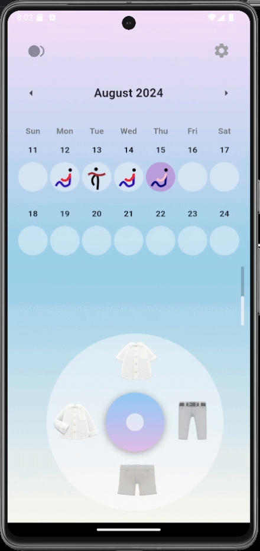

# 👕서비스 소개

## 서비스 설명

### 개요

- 서비스 명 : 기웃기옷
- 한 줄 소개 : 음성 기반 옷 기억 서비스

### 타겟
- 매일 출근할 때 무엇을 입을지 고민되는 사람
- 스타일리쉬한 이미지를 쌓고 싶은 사람
- 어제 입은 옷도 잘 기억나지 않는 사람

# 👕기획 배경

## 배경
오늘 뭐 입지? 
매일 정기적으로 어딘가로 출근하고, 비슷한 사람을 만난다면 나갈 준비를 하며 이 고민을 한번쯤 해보셨을 겁니다. 
우리는 옷을 정하기 귀찮아 하면서도, 그렇다고 매일 같은 옷을 입고싶지는 않습니다. 자주 보는 사람들이 내 모습을 보고 '저 사람은 옷이 하나밖에 없나봐...' 라고 생각하는 건 싫기 때문이죠.  
당신만의 기깔나는 옷장, 기웃기옷은 당신이 입으려는 옷이 사람들의 기억에 남아있는지 알려줍니다. 만약 오늘 입으려는 옷이 아직 사람들의 기억에 남아있다면, 다른 옷을 선택해 좀 더 스타일리쉬한 이미지를 갖출 수 있어요.  
기웃기옷을 통해 단조로운 일상에 당신만의 스타일을 더해보세요. 

## 목적
- 사용자의 옷이 주변 사람들에게 얼마나 기억되었는지 알려주는 서비스
- 사용자가 코디를 쉽게 기록할 수 있는 서비스

# 👕기능 소개
1. 로그인

 

- OAuth 를 활용한 Google, Naver, Kakao 로그인

2. 메인 페이지 (모래시계)

 

- 메인 페이지 시작 시 기억도가 낮은 구슬부터 내려옴옴
- 설명 구슬: 클릭 시 앱 동작 원리 설명명
- 입었던 옷 기억도 조회
- 아직 사람들의 기억에 남아있는 옷은 모래시계 상단, 잊혀진 옷은 모래시계 하단에 위치
- 각 구슬 클릭 시 옷 정보 상세조회 가능

3. 코디 등록
    1) 음성으로 등록
      
    - 사용자는 음성을 통해 그날의 코디 등록  
    ex: 나 오늘 빨간색 반팔 니트 입을래
    - 서비스와의 대화를 통한 등록
    
    2) 직접 등록
      
    - 45일간의 데이터 중 겹치는 코디의 주기를 분석해 사용자의 빠른 선택 지원
    - 상/하의, 색, 옷 종류를 직접 선택해 등록

4. 코디 캘린더
  
- 과거 2주일 간 코디 조회
- 픽토그램으로 색 중심 코디 표현
- 각 날짜의 픽토그램은 그날의 활동량에 따라 3가지 자세로 표현

5. 설정
- 음성 분석이 활성화 될 출퇴근 시간 수정
- 회원정보(닉네임) 수정
- 튜토리얼 다시보기 제공
- 회원탈퇴

# 👕기술 스택

## 기능 별 기술 스택
1. 코디 입력

2. 음성 분석

## 개발 환경

### System Architecture

   
             

# 산출물

## 프로젝트 일정

## 프로젝트 설계

Figma

ERD

API 명세서

# 👕개발 멤버
<table>
    <tr>
        <td height="140px" align="center"> 
              👑 이재성 </td>
        <td height="140px" align="center">
              ⛑ 신희진 </td>
        <td height="140px" align="center">
              ⛑ 류인환 </td>
        <td height="140px" align="center">
              ⛑ 이은우 </td>
        <td height="140px" align="center"> 
              ⛑ 정진영 </td>
        <td height="140px" align="center"> 
              ⛑ 김규림 </td>
    </tr>
    <tr>
        <td align="center">AI/ML Backend</td>
        <td align="center">AI/ML Frontend</td>
        <td align="center">Backend</td>
        <td align="center">Infra CI/CD Backend</td>
        <td align="center">Frontend</td>
        <td align="center">Frontend</td>
    </tr>
</table>

# 👕회고
